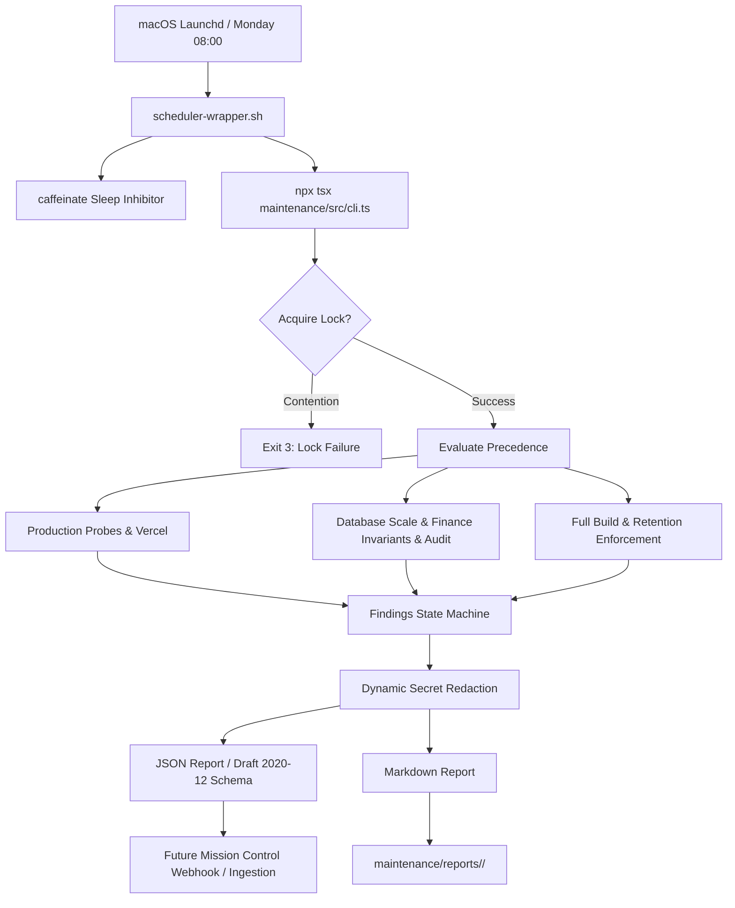

# CMS Automated Preventive Maintenance Framework (MAINT-AUTO-1)

A lightweight, strictly read-only automated maintenance framework designed for scheduled execution on macOS and seamless telemetry ingestion by Mission Control.

---

## 1. Cadences & Execution Scope

The framework operates across three tiered maintenance levels:

| Cadence | Schedule | Scope | Quality Gates |
| :--- | :--- | :--- | :--- |
| **Weekly** | Every Monday 08:00 (default) | Production Health Watch: 10 HTTP probes across 5 tiers, Vercel deployment verification, database ping, baseline SHA tracking | Skipped for fast execution |
| **Monthly** | 1st Monday of Feb, Mar, May, Jun, Aug, Sep, Nov, Dec | Preventive Maintenance Audit: All Weekly checks + Database Scale Snapshot (MAINT-PERF-1 triggers), 6 Financial Invariants, `npm audit` (read-only) | Vitest, TypeScript, ESLint |
| **Quarterly** | 1st Monday of Jan, Apr, Jul, Oct | Deep Engineering Review: All Monthly checks + Full Next.js production build (`npm run build`), report retention enforcement | Vitest, TypeScript, ESLint, Next.js Build |

---

## 2. Architecture & Workflow



---

## 3. Mission Control Integration Contract

The framework produces deterministic, machine-readable JSON artifacts compliant with JSON Schema Draft 2020-12 (`maintenance/schemas/maintenance-report.schema.json`).

### A. Finding Lifecycle State Machine
Findings are tracked in `maintenance/state/findings-state.json`:
- **`NEW`**: Detected for the first time in the current run (`occurrences = 1`).
- **`PERSISTENT`**: Detected in previous runs and still detected (`occurrences = n + 1`).
- **`RESOLVED`**: Was active in previous runs but no longer detected in the current run.

### B. Stable Fingerprinting
Findings use a deterministic fingerprint format:
```
<CHECK_CODE>:<8_CHAR_SHA256_HASH>
```
Example: `PROD_HTTP_STATUS:4f2a9e10`, `FIN_ORPHAN_PAYMENTS:8bc31f90`.

### C. Status Levels & Exit Codes
| Status | Exit Code | Description |
| :--- | :--- | :--- |
| `HEALTHY` | `0` | All probes and checks passed cleanly. No critical or warning findings. |
| `WARNING` | `1` | Degraded latency, moderate audit findings, or uncommitted changes. |
| `ACTION_REQUIRED` | `2` | Failed production probe, financial invariant violation, or quality gate failure. |
| `EXECUTION_FAILURE` | `3` | Lock contention, fatal network disconnection, or unhandled runner exception. |

---

## 4. Safety & Non-Mutation Guarantees

1. **Zero Production Mutation**: Database connections explicitly enforce `default_transaction_read_only = on` with a `15s` statement timeout. Only SELECT queries are executed.
2. **Zero Schema Migrations**: No schema files or migrations are touched.
3. **Zero Dependency Changes**: Dependencies in `package.json` are frozen byte-for-byte. `npm audit fix` is strictly prohibited.
4. **Dynamic Secret Redaction**: All reports scrub database URLs, Stripe keys, Resend keys, JWTs, bearer tokens, and any value present in the process environment.
5. **Git Tree Cleanliness**: Reports, logs, and lockfiles are ignored by `.gitignore` while keeping directory `.gitkeep` files tracked.

---

## 5. Operator Runbook

### Running On-Demand
```bash
# Weekly Production Watch (dry-run)
npx tsx maintenance/src/cli.ts --level=weekly --dry-run

# Monthly Audit with Quality Gates (live execution)
npx tsx maintenance/src/cli.ts --level=monthly

# Quarterly Deep Review
npx tsx maintenance/src/cli.ts --level=quarterly

# Automatic calendar precedence resolution
npx tsx maintenance/src/cli.ts --auto-cadence
```

#### CLI Options & Flags
| Flag | Description | Default |
| :--- | :--- | :--- |
| `--level=<weekly\|monthly\|quarterly>` | Sets the maintenance cadence level to execute. | `weekly` |
| `--auto-cadence` | Automatically determines cadence from calendar date precedence. | Disabled |
| `--dry-run` | Executes checks and generates reports in memory without writing to disk or updating state. | `false` |
| `--skip-quality-gates` | Skips unit test, TypeScript, and lint gates during monthly/quarterly runs (useful for rapid probe validation). | `false` |
| `--output-json=<path>` | Custom destination path for the generated JSON report. | `maintenance/reports/<level>/<reportId>.json` |
| `--output-md=<path>` | Custom destination path for the generated Markdown report. | `maintenance/reports/<level>/<reportId>.md` |

### Launchd Activation (Future Kwadwo Step)
> [!IMPORTANT]
> Do NOT activate launchd during Stage A/B. When ready to activate on Kwadwo's Mac mini:

```bash
# 1. Copy plist to LaunchAgents directory
cp maintenance/scripts/launchd/com.afterschoolclub.cms-maintenance.plist ~/Library/LaunchAgents/

# 2. Load agent into launchd
launchctl load ~/Library/LaunchAgents/com.afterschoolclub.cms-maintenance.plist

# 3. Verify status
launchctl list | grep com.afterschoolclub.cms-maintenance

# 4. To unload/deactivate
launchctl unload ~/Library/LaunchAgents/com.afterschoolclub.cms-maintenance.plist
```
