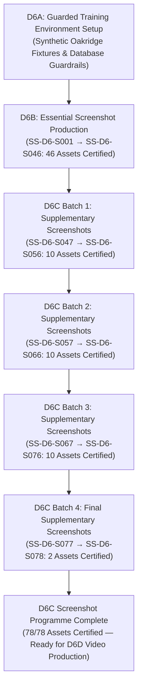

# SprintScale CMS — Master Screenshot Production Programme Closure (Phase D6C)
## Formal Closure & Verification Report for the Complete 78-Screenshot Canonical Visual Inventory

**Programme Phase**: Milestone D6C — Screenshot Production Closure  
**Date of Certification**: 2026-08-29  
**Agent**: Visual Production Agent (SprintScale CMS)  
**Target Environment**: Guarded Neon Training Database (`ep-aged-morning-abr2278f.eu-west-2.aws.neon.tech`)  
**Safety Protocol**: `assertSafeTrainingEnvironment()` (`ALLOW_TRAINING_SEED=true`, `TRAINING_ENVIRONMENT=oakridge`)  
**Inventory Scope**: Canonical Screenshots `SS-D6-S001` through `SS-D6-S078`  
**Overall Status**: **100% COMPLETE — FULLY CERTIFIED & CLOSED**  

---

## 1. Executive Summary & Inventory Arithmetic

This document certifies the formal completion and closure of the entire SprintScale CMS screenshot production programme. Across Milestones D6A, D6B, and D6C (Batches 1 through 4), all 78 canonical screenshot assets defined in the master documentation and training specifications have been captured directly from the live rendered CMS, annotated using the standardized D6 visual teaching callout language, and verified against actual product truth.

### Final Screenshot Programme Arithmetic
- **Master Canonical Screenshot Inventory**: **78 Assets**
- **Essential Screenshots (D6B Certified)**: **46 Assets** (`SS-D6-S001` → `SS-D6-S046`)
- **Supplementary Screenshots (D6C Certified)**: **32 Assets** (`SS-D6-S047` → `SS-D6-S078`)
  - Batch 1 (`SS-D6-S047` → `SS-D6-S056`): 10 Assets
  - Batch 2 (`SS-D6-S057` → `SS-D6-S066`): 10 Assets
  - Batch 3 (`SS-D6-S067` → `SS-D6-S076`): 10 Assets
  - Batch 4 (`SS-D6-S077` → `SS-D6-S078`): 2 Assets
- **Total Certified Source PNGs**: **78 / 78 (100.0%)**
- **Total Certified Annotated PNGs**: **78 / 78 (100.0%)**
- **Outstanding Screenshots**: **0**

---

## 2. Milestone Lineage & Delivery Milestones

1. **Milestone D6A**: Established the isolated synthetic Oakridge Learning Trust environment with `assertSafeTrainingEnvironment()`, zero production database exposure, and realistic test fixtures for all 6 core roles.
2. **Milestone D6B**: Produced and certified all 46 Essential (P0/P1) screenshots (`SS-D6-S001` → `SS-D6-S046`), establishing the foundational visual reference base for manual, role guide, and quick start training.
3. **Milestone D6C Batch 1**: Produced 10 supplementary screenshots (`SS-D6-S047` → `SS-D6-S056`) covering parent invitations, student emergency contacts, walk-in registers, bank holiday indicators, and parent portal onboarding.
4. **Milestone D6C Batch 2**: Produced 10 supplementary screenshots (`SS-D6-S057` → `SS-D6-S066`) covering parent communication histories, audit trails, sibling discount matrices, offline cash logging, instalment schedules, and tax-free childcare reconciliation.
5. **Milestone D6C Batch 3**: Produced 10 supplementary screenshots (`SS-D6-S067` → `SS-D6-S076`) covering timelog editing, bulk attendance roll call, session capacity distribution, rescheduling dialogues, cancellation confirmations, public confirmation screens, registration decline workflows, empty states, rate-limiting throttle screens, and finance CSV exports.
6. **Milestone D6C Batch 4**: Produced the final 2 supplementary screenshots (`SS-D6-S077` and `SS-D6-S078`), completing the attendance daily register overview and external school MIS integration management cards.

---

## 3. Pedagogical Principles & Product Truth Reconciliation

Throughout the production programme, SprintScale visual production adhered to a fundamental evidence principle:

> **"The visual inventory documents implemented product truth rather than manufacturing synthetic or fabricated UI states solely to satisfy an earlier or out-of-date specification."**

Whenever specifications or preliminary registry entries conflicted with actual product architecture, visual production reconciled the documentation, asset registry, and teaching callouts to match the live software rather than altering product code to fit stale wording:

- **`SS-D6-S025` (Access Restriction)**: Reconciled from a generic 403 page to the actual implemented inline role banner ("Restricted Area — Owner Only").
- **`SS-D6-S063` (Inline Invoice Editing)**: Reconciled from a nonexistent edit modal to the real inline invoice metadata editor.
- **`SS-D6-S064` (Manual Payment Reconciliation Form)**: Reconciled from a standalone modal to the in-page Tax-Free Childcare & Cash reconciliation form.
- **`SS-D6-S069` (Session Bookings & Status Distribution)**: Reconciled from an unrendered capacity-warning badge to the real bookings data table with multi-criteria status filter counts.
- **`SS-D6-S073` (Registration Decline Status Selection)**: Reconciled from a nonexistent rejection modal to the live interactive status dropdown menu.
- **`SS-D6-S076` (Finance CSV Export Action)**: Reconciled from a nonexistent export dialogue to the direct file streaming action.
- **`SS-D6-S077` (Attendance Daily Register & Roll Call Overview)**: Reconciled from a nonexistent export dialogue to the daily register and live roll call session controls.
- **`SS-D6-S078` (External Integration Statuses Card)**: Route accurately pinned to `/dashboard/settings/wonde` reflecting the live MIS Integration Status card.

*(Note: Production of visual evidence does not constitute a legal, statutory, Ofsted, GDPR, or safeguarding compliance claim.)*

---

## 4. Master Canonical Screenshot Inventory Status (All 78 Assets)

| ID Range | Module Coverage | Essential | Standard / Advanced | Count | Status |
|---|---|---|---|---|---|
| `SS-D6-S001` → `SS-D6-S010` | Foundations, People, Intake | 10 | 0 | 10 | **CERTIFIED** |
| `SS-D6-S011` → `SS-D6-S020` | Bookings, Classroom, Kiosk | 10 | 0 | 10 | **CERTIFIED** |
| `SS-D6-S021` → `SS-D6-S030` | Classroom Ledger, Finance, Admin | 10 | 0 | 10 | **CERTIFIED** |
| `SS-D6-S031` → `SS-D6-S040` | Reports, Parent Portal, Incidents | 10 | 0 | 10 | **CERTIFIED** |
| `SS-D6-S041` → `SS-D6-S046` | Parent Portal Payments & Security | 6 | 0 | 6 | **CERTIFIED** |
| `SS-D6-S047` → `SS-D6-S056` | Communications, Discounts, Calendar | 0 | 10 | 10 | **CERTIFIED** |
| `SS-D6-S057` → `SS-D6-S066` | Audit Trails, Finance Instalments | 0 | 10 | 10 | **CERTIFIED** |
| `SS-D6-S067` → `SS-D6-S076` | Triage, Empty States, Throttle | 0 | 10 | 10 | **CERTIFIED** |
| `SS-D6-S077` → `SS-D6-S078` | Attendance Overview, MIS Integration | 0 | 2 | 2 | **CERTIFIED** |
| **TOTAL** | **ALL MODULES** | **46** | **32** | **78** | **100% COMPLETE** |

---

## 5. Technical Validation & Quality Gates Summary

- **Source Image Count**: **78 / 78 PNGs** (all 1440 × 900, unscaled, non-zero, readable)
- **Annotated Image Count**: **78 / 78 PNGs** (all 1440 × 900, annotated with `#2563EB` callouts)
- **Missing Asset IDs**: **0**
- **Corrupted / Invalid Images**: **0**
- **Unverified Assets**: **0**
- **TypeScript Compilation**: `npx tsc --noEmit` (**0 errors**)
- **ESLint**: `npm run lint` (**0 errors / 0 warnings**)
- **Vitest Test Suite**: `npm test -- --run` (**66 test files passed, 618 tests passed**)

---

## 6. Readiness for Phase D6D (Micro-Video Production)

With all 78 canonical screenshots produced, reconciled, and certified in the asset registry and production logs, Milestone D6C is **OFFICIALLY CLOSED**.

The repository is now fully prepared for Milestone D6D (Micro-Video Screencast Production, `SS-D6-V001` → `SS-D6-V052`).
