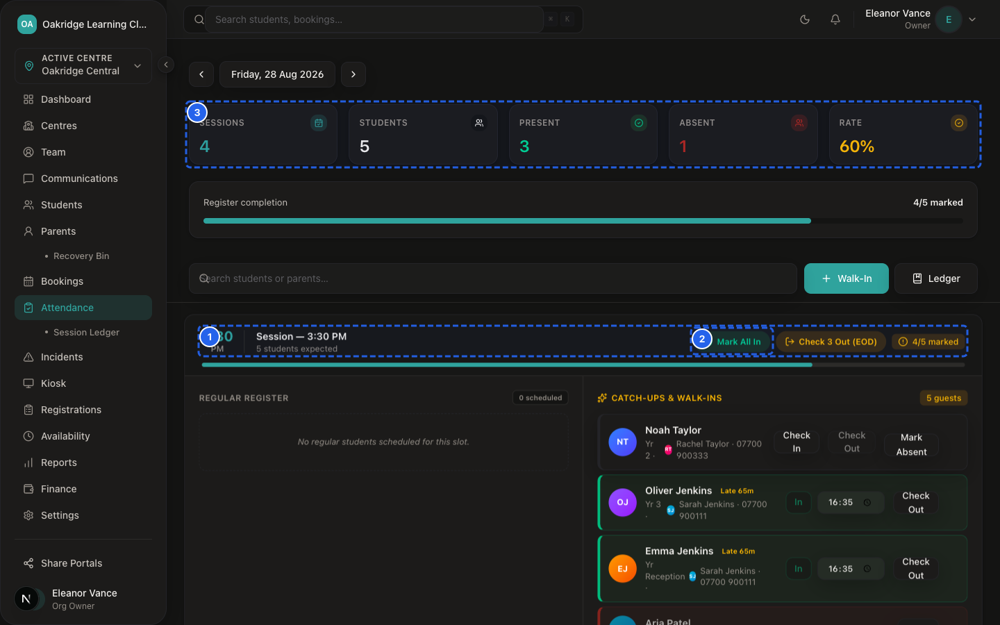
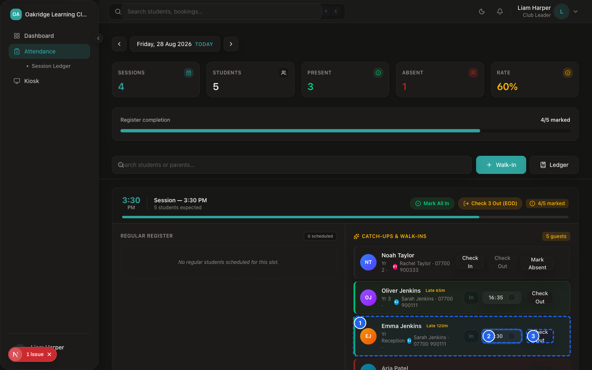
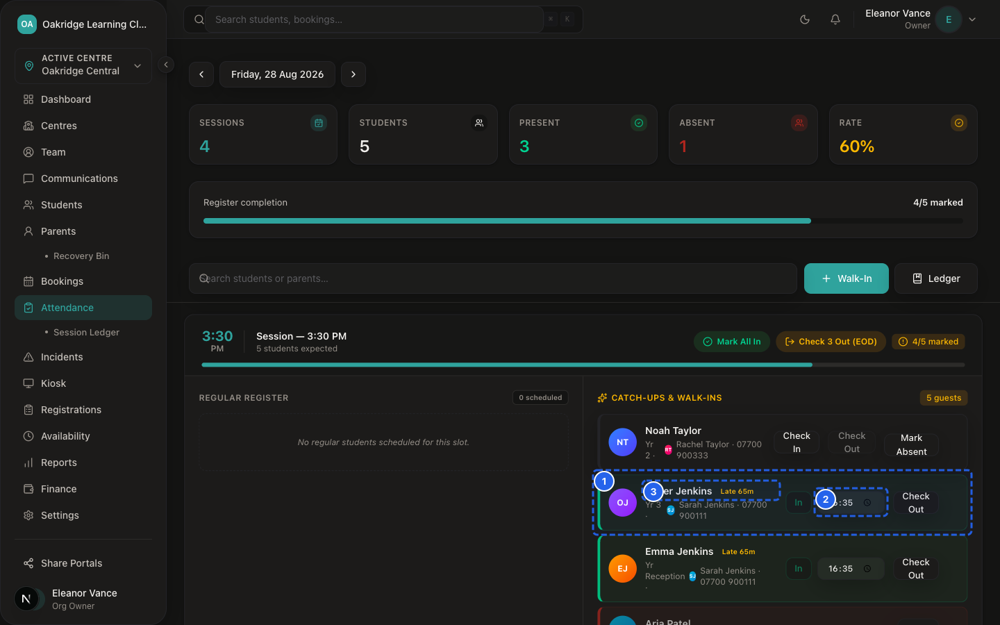
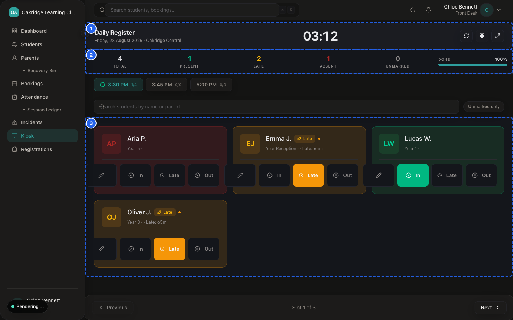
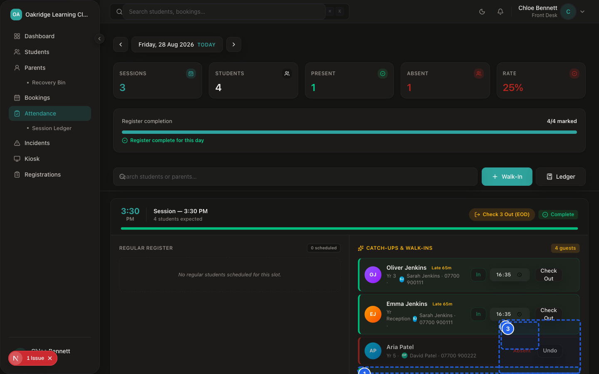
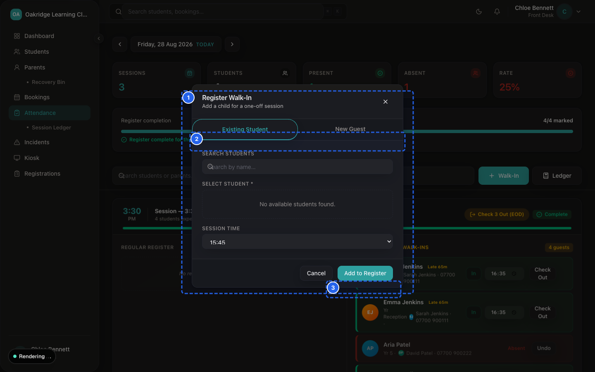
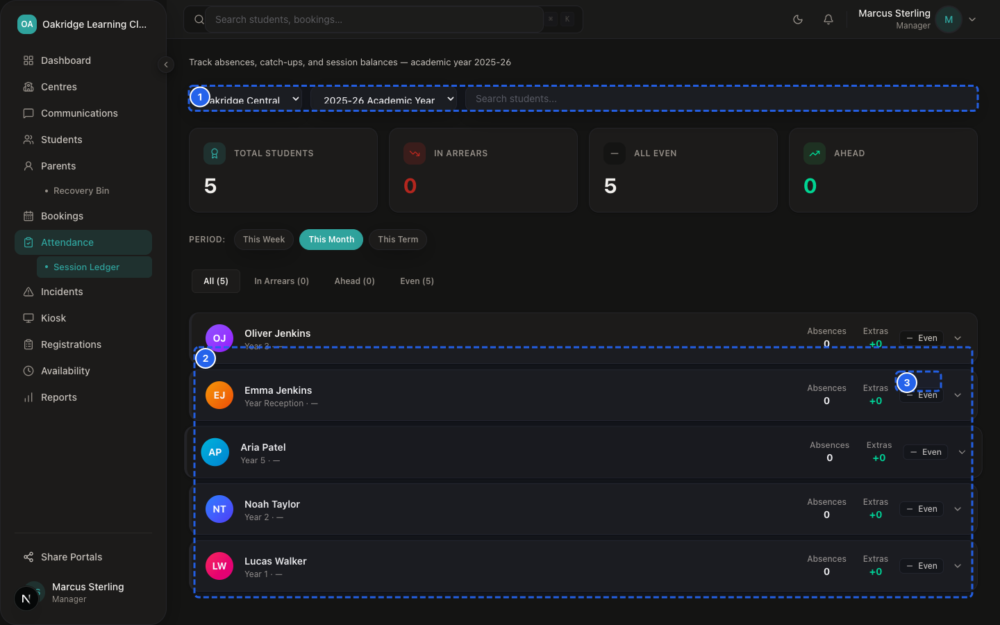
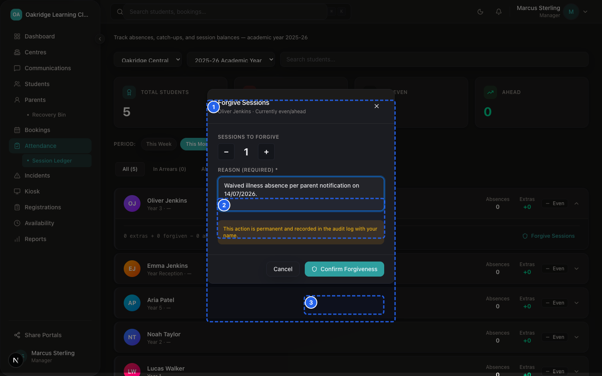

# SprintScale CMS — Functional Manual: Attendance & Roll Call
## Daily Registers, Tablet Kiosk Mode, Time Tracking & Session Ledger

---

## 1. What Attendance Is For

The **Attendance Module** (`/dashboard/attendance`) is the daily register and attendance tracking tool for your club organisation.

It enables staff to:
- Conduct live session roll calls with recorded arrival and departure timestamps.
- Operate a streamlined, touchscreen **Tablet Kiosk** (`/dashboard/kiosk`) at club entrances.
- Automatically derive and track **Late Minutes** when children arrive after scheduled start times.
- Record structured absence reasons (`Illness`, `Holiday`, `Family`, `Other`).
- Handle on-demand **Walk-In** arrivals for unexpected or unbooked children.
- Reconcile missed sessions and absence arrears in the **Session Credit Ledger** using administrative **Forgiveness Credits**.
- Display high-contrast **Medical Alert Badges** (Red = Severe Allergy/Condition, Yellow = Dietary, Blue = SEN) directly on roll-call cards.

---

## 2. Attendance vs. Booking: Key Distinction

| Concept | Definition & Scope | Operational Meaning |
|---|---|---|
| **Booking** | A scheduled appointment or reservation for a future session date. | Represents **intent to attend**. Created in advance via parent portal, public link, or back office. |
| **Attendance** | The real-time record of physical arrival, presence, and departure. | Represents **actual presence**. Tracks whether the child was physically on site, when they arrived, and when they were collected. |

> [!NOTE]
> A child may have a confirmed booking but be marked **Absent**. Conversely, a child without a prior booking who arrives at the door can be admitted via an immediate **Walk-In Booking** and checked in.

---

## 3. Who Can Use It (Role Permissions)

| Capability / Action | Owner (`ORG_OWNER`) | Manager (`MANAGER`) | Front Desk (`FRONT_DESK`) | Tutor (`TUTOR`) | Parent (`PARENT`) | Evidence Source |
|---|---|---|---|---|---|---|
| **View Attendance Register** | ✅ Full (All Centres) | ✅ Centre-Scoped | ✅ Centre-Scoped | ✅ Centre-Scoped | ❌ No Access | `attendance/page.tsx` |
| **Live Roll Call Check-in/out**| ✅ Full Access | ✅ Full Access | ✅ Full Access | ✅ Full Access | ❌ No Access | `updateAttendanceTimelog` |
| **Tablet Kiosk Mode** | ✅ Full Access | ✅ Full Access | ✅ Full Access | ✅ Full Access | ❌ No Access | `kiosk/page.tsx` |
| **Mark Absent & Reasons** | ✅ Full Access | ✅ Full Access | ✅ Full Access | ✅ Full Access | ❌ No Access | `updateAttendanceTimelog` |
| **Toggle Homework/Behaviour** | ✅ Full Access | ✅ Full Access | ✅ Full Access | ✅ Full Access | ❌ No Access | `updateChildFlags` |
| **View Session Credit Ledger** | ✅ Full (All Centres) | ✅ Centre-Scoped | ❌ No Access | ❌ No Access | ❌ No Access | `attendance/ledger` |
| **Grant Forgiveness Credits** | ✅ Full Access | ✅ Centre-Scoped | ❌ No Access | ❌ No Access | ❌ No Access | `forgiveSessionsAction` |

---

## 4. Attendance States & Timestamp Tracking

SprintScale records exact ISO timestamps for attendance state transitions:

```
┌─────────────────────────────────────────────────────────────┐
│                 ATTENDANCE STATUS LIFECYCLE                 │
├─────────────────────────────────────────────────────────────┤
│  • `expected`: Booked for session; awaiting arrival         │
│  • `present`: Checked in at or before scheduled start time  │
│  • `late`: Checked in after start time (late minutes logged)│
│  • `absent`: Marked not attending with structured reason    │
│  • `checked_out`: Child marked as collected and departed    │
└─────────────────────────────────────────────────────────────┘
```

### Audit Fields Logged on Every Check-In/Out:
These fields support accurate operational records and an auditable record of who marked attendance:
- `checkInAt`: Precise date and time when the child was marked checked in.
- `checkOutAt`: Precise date and time when the child was marked checked out.
- `lateMinutes`: Calculated automatically as the difference between check-in time and configured session start time.
- `attendanceMarkedBy`: User ID of the authenticated staff member who performed the action.
- `attendanceMarkedAt`: Server timestamp when the record was written.

---

## 5. Step-by-Step Procedures

### Procedure 1: Conducting Daily Roll Call on the Register


*Figure 6.1 — Daily Attendance Register*


*Figure 6.2 — Daily Register Header Statistics*

📹 **Video Walkthrough:** [Watch: Marking Morning and Afternoon Class Register](../assets/videos/SS-D6-V006.mp4)


*Figure 6.3 — Live Arrival Timelog*


*Figure 6.4 — Bulk Check-In Action*


*Figure 6.5 — Live Check-Out Timelog*


*Figure 6.6 — Timelog Correction Controls*

📹 **Video Walkthrough:** [Watch: Adjusting Attendance Arrival Timelogs](../assets/videos/SS-D6-V041.mp4)

📹 **Video Walkthrough:** [Watch: Exporting Daily Roll Call Attendance CSV](../assets/videos/SS-D6-V042.mp4)
**Who Can Do This:** Owner, Manager, Front Desk, Tutor

**Steps:**
1. Navigate to: `Sidebar → Attendance` (`/dashboard/attendance`).
2. Verify the active **Centre** in the top bar.
3. Select the **Session Date** (defaults to today).
4. Review the roster of expected children.
5. As each child enters the room:
   - Click **Check In**.
   - If the current time is after the session start time, the card updates to **Late** and displays the calculated late minutes (e.g. *15m late*).
   - If on time, status marks green **Present**.
6. At pickup time:
   - Verify the collecting adult against the student's **Authorised Collectors** list.
   - Click **Check Out**.

---

### Procedure 2: Operating Tablet Kiosk Mode (Fast Touch Check-In)


*Figure 6.7 — Tablet Kiosk Mode Interface*

📹 **Video Walkthrough:** [Watch: Operating the Tablet Kiosk Sign-In & Pick-Up](../assets/videos/SS-D6-V007.mp4)
**Who Can Do This:** Owner, Manager, Front Desk, Tutor

**Steps:**
1. Open a tablet browser at the club entrance and navigate to: `Sidebar → Kiosk` (`/dashboard/kiosk`).
2. The interface expands to a touch-optimized card grid.
3. **To Check In:** Tap the green **Check In** button on the child's card. The button transitions to a green checkmark with the check-in time.
4. **To Check Out:** Tap **Check Out** when the parent collects the child.
5. **PIN Security:** If PIN protection is enabled, staff enter their 4-digit staff PIN to unlock administrative overrides.

> [!NOTE]
> The Kiosk interface is responsive and automatically adjusts its layout across mobile (375px+) and tablet viewports.

---

### Procedure 3: Recording an Absence & Reason


*Figure 6.8 — Absence Reason Override Modal*

📹 **Video Walkthrough:** [Watch: Overriding Attendance Status (Late / Excused)](../assets/videos/SS-D6-V009.mp4)
**Who Can Do This:** Owner, Manager, Front Desk, Tutor

**Steps:**
1. On the attendance register (`/dashboard/attendance`), locate the absent child.
2. Click **Absent**.
3. In the popup modal, select the **Absence Reason**:
   - `Illness`
   - `Holiday`
   - `Family`
   - `Other`
4. (Optional) Enter an **Attendance Note** (e.g. "Parent called to report mild illness").
5. Click **Confirm Absence**.
6. The record is updated, and the absence is logged in the **Session Credit Ledger**.

---

### Procedure 4: Handling an Unscheduled Walk-In Arrival


*Figure 6.9 — Kiosk Fast Walk-In Intake Dialog*

📹 **Video Walkthrough:** [Watch: Fast Walk-In Registration from Daily Attendance](../assets/videos/SS-D6-V008.mp4)
**Who Can Do This:** Owner, Manager, Front Desk

**Steps:**
1. When an unbooked child arrives at reception, click **+ Walk-In** on the attendance register (or navigate to `Sidebar → Bookings → + New Booking`).
2. Search the parent's phone number or child's name.
3. Select today's date and the current session time slot.
4. Click **Create Booking**.
5. The child immediately appears on today's attendance register.
6. Click **Check In** to record the arrival timestamp.

---

### Procedure 5: Toggling Operational Flags (Homework & Behaviour)
**Who Can Do This:** Owner, Manager, Front Desk, Tutor

**Steps:**
1. On the child's attendance card in `/dashboard/attendance`, locate the flag icons.
2. Click the **Homework** icon to toggle active.
3. Click the **Behaviour** icon to toggle positive recognition.
4. Optionally enter a brief **Flag Note** (e.g. "Completed worksheet 3").
5. The flags update immediately on the card for all staff on duty.

---

## 6. The Session Credit Ledger & Absence Forgiveness


*Figure 6.10 — Session Credit Ledger Overview*


*Figure 6.11 — Admin Session Forgiveness Modal*

📹 **Video Walkthrough:** [Watch: Forgiving an Absence on Session Credit Ledger](../assets/videos/SS-D6-V010.mp4)

The **Session Credit Ledger** (`/dashboard/attendance/ledger`) reconciles missed sessions and attendance arrears without editing issued invoices.

### Net Balance Formula:
$$\text{Net Balance} = \text{Extra Sessions Attended} + \text{Forgiven Sessions} - \text{Scheduled Absences}$$

- **Positive Balance:** Family attended more sessions than scheduled (or received credits).
- **Negative Balance (Red):** Family has unexcused absence arrears.
- **Zero Balance:** Reconciled session balance.

### Procedure: Applying a Forgiveness Credit
**Who Can Do This:** **Organisation Owner** (`ORG_OWNER`) or **Centre Manager** (`MANAGER`)

1. Navigate to: `Sidebar → Attendance → Session Ledger` (`/dashboard/attendance/ledger`).
2. Select your Centre and Academic Year.
3. Locate the student in arrears (indicated with a negative balance).
4. Click **Forgive Sessions**.
5. Enter the **Sessions Amount** (e.g. `1` or `2`).
6. Enter an **Audit Note** (e.g. "Absence approved per club policy").
7. Click **Grant Forgiveness Credit**.
8. The ledger balance updates immediately, and the credit is recorded in `sessionCredits` with the manager's name and timestamp.

---

## 7. Zero-Centre Staff Handling & Error Prevention

If a staff member logs in without being assigned to any active centre:
- The attendance register displays a clear notice: *"No accessible centres assigned to your account. Please contact your Organisation Owner."*
- The system prevents crashes and blocks attendance modifications until an Owner assigns centre memberships in `Sidebar → Team`.

---

## 8. Attendance Troubleshooting Quick Reference

| Issue | Cause | Solution |
|---|---|---|
| **Child is missing from today's roll call** | Child has not been booked for today's session, or is assigned to a different centre. | Check `Sidebar → Bookings` to create a booking or log a **+ Walk-In**, then check in. |
| **Check-in button displays "Late" unexpectedly** | Check-in time was after the scheduled slot start time (e.g. 15:45 start, checked in at 15:52 = 7m late). | Late minutes are calculated automatically from the slot start time. |
| **Front Desk cannot see Forgive Sessions button** | Forgiveness is restricted in code to Managers and Owners. | Escalate the absence forgiveness request to the Centre Manager or Owner. |
| **Kiosk cards overlapping on phone/tablet** | Browser zoom is set above 100%. | Reset browser zoom to 100%. Responsive CSS automatically stacks cards on 375px+ screens. |
