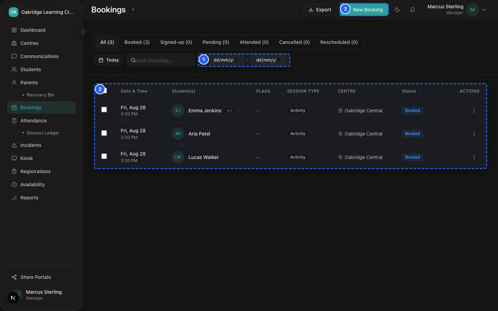
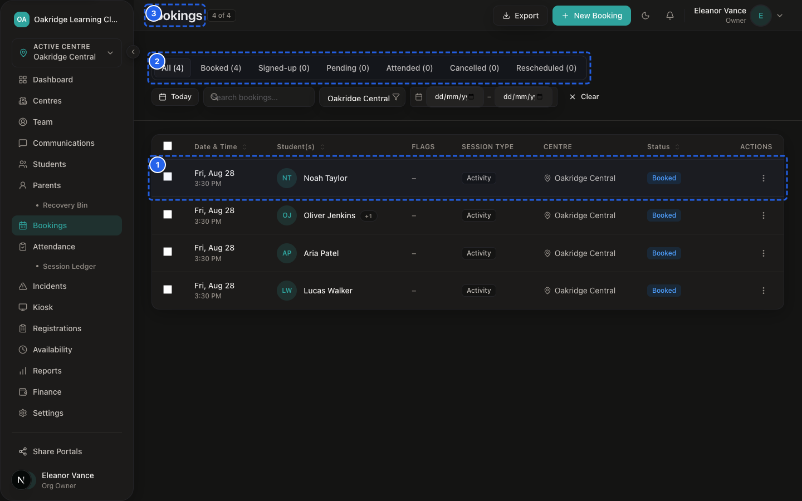
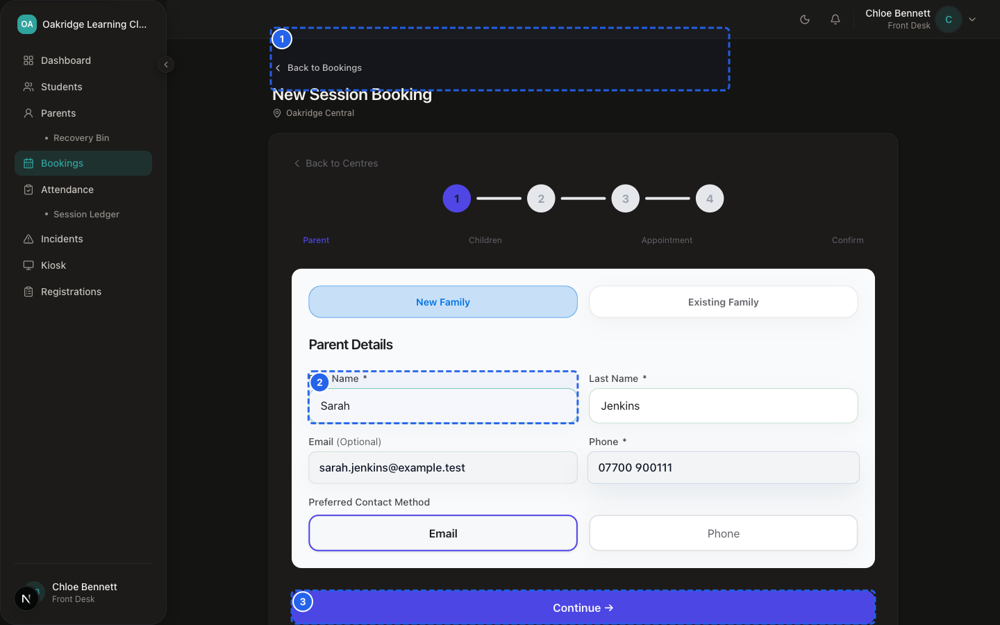
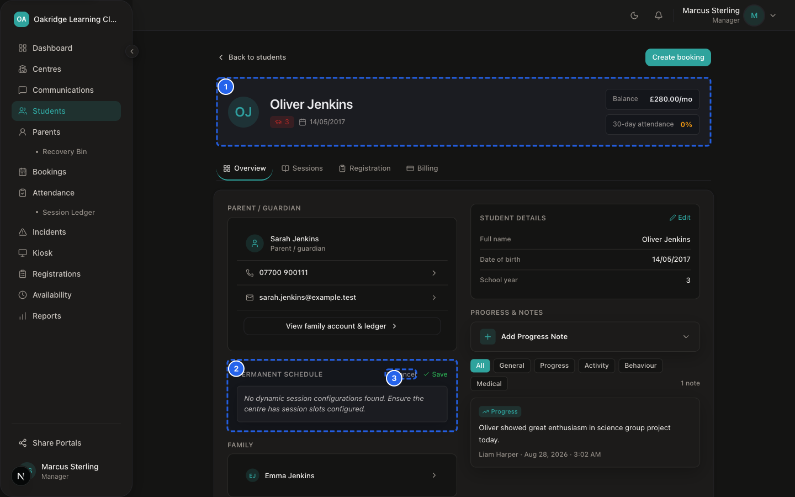
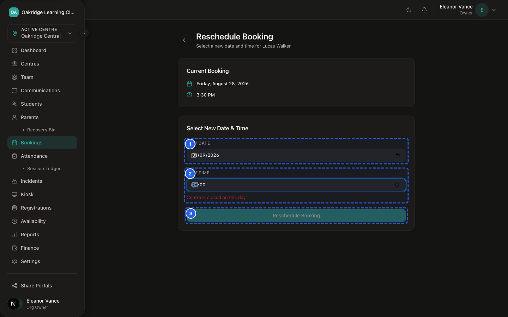
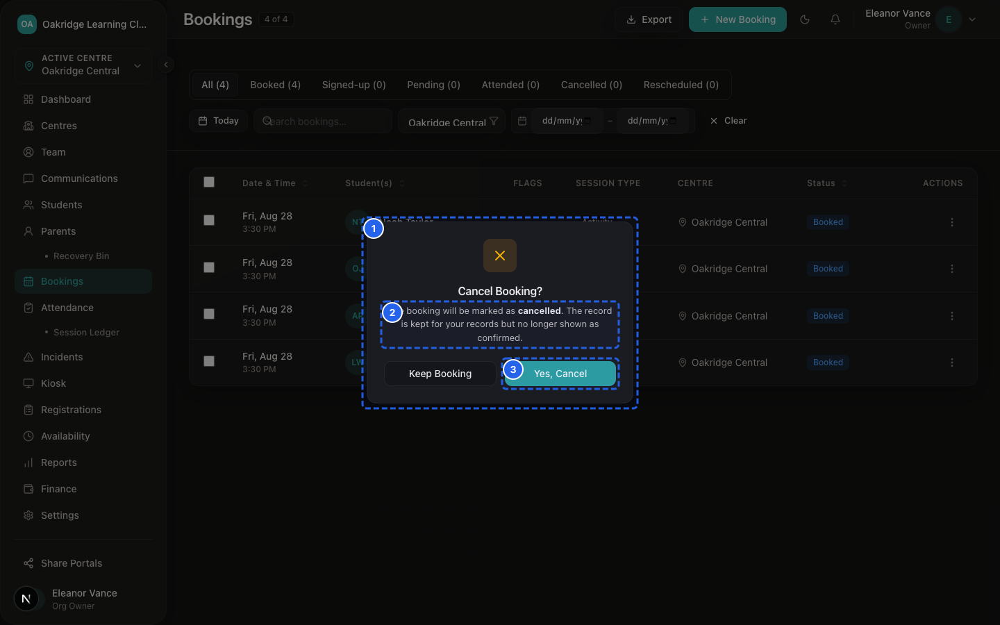
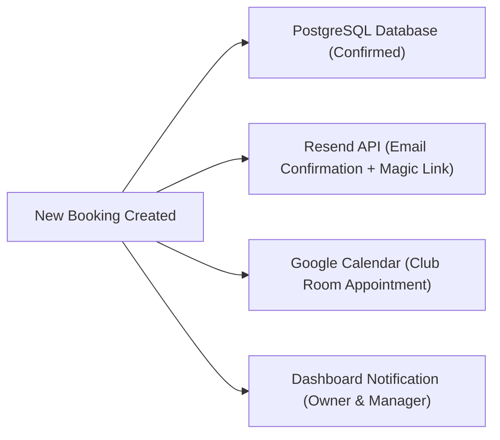

# SprintScale CMS — Functional Manual: Bookings & Scheduling
## Session Appointments, Public Booking Wizards, Capacity & Rescheduling

---

## 1. What the Booking System Is For


*Figure 5.1 — Weekly Booking Matrix & Venue Capacity Overview*


*Figure 5.2 — Session Bookings & Status Distribution Roster*

The **Bookings Module** (`/dashboard/bookings`) manages the scheduling, capacity, and attendance eligibility of club sessions and assessment appointments across all centres.

It provides four distinct booking surfaces:
1. **Public Booking Wizard (`/book/[orgSlug]`):** Self-service appointment booking for prospective or existing parents from club marketing links.
2. **Parent Portal Booking (`/portal/book`):** Direct session booking for logged-in parents with pre-populated child details.
3. **Staff Back-Office Booking (`/dashboard/bookings/new`):** Administrative scheduling created by managers or front-desk staff.
4. **Walk-In Booking:** Fast on-demand session creation when an unexpected or unregistered child arrives on site.

---

## 2. Who Can Use Each Booking Route (Permissions)

| Booking Surface / Action | Owner | Manager | Front Desk | Tutor | Parent |
|---|---|---|---|---|---|
| **Public Booking Form** (`/book/[slug]`) | ✅ Accessible | ✅ Accessible | ✅ Accessible | ✅ Accessible | ✅ Public Access |
| **Parent Portal Booking** (`/portal/book`)| ❌ No Access | ❌ No Access | ❌ No Access | ❌ No Access | ✅ Own Children |
| **Staff Booking Creation** (`/bookings/new`)| ✅ Full Access | ✅ Centre-Scoped | ✅ Centre-Scoped | ❌ No Access | ❌ No Access |
| **Walk-In Booking Creation** | ✅ Full Access | ✅ Centre-Scoped | ✅ Centre-Scoped | ❌ No Access | ❌ No Access |
| **Reschedule / Cancel Booking** | ✅ Full Access | ✅ Centre-Scoped | ✅ Centre-Scoped | ❌ No Access | ✅ Own Bookings |
| **Assessment Scorecard & Feedback** | ✅ Full Access | ✅ Full Access | ✅ Full Access | ✅ Draft Feedback | ❌ View Sent Only |

---

## 3. Booking Lifecycle & Canonical Statuses

```
┌─────────────────────────────────────────────────────────────┐
│                    BOOKING STATUS LIFECYCLE                 │
├─────────────────────────────────────────────────────────────┤
│  • `confirmed`: Scheduled and active on daily registers     │
│  • `rescheduled`: Superseded by a new date/time slot        │
│  • `cancelled`: Cancelled by parent or staff; slot released │
│  • `completed`: Session took place and attendance marked    │
│  • `signed_up`: Enrolled into recurring club programme      │
└─────────────────────────────────────────────────────────────┘
```

---

## 4. Step-by-Step Procedures

### Procedure 1: Creating a Staff Booking


*Figure 5.3 — Ad-Hoc Single Session Booking Modal*

📹 **Video Walkthrough:** [Watch: Creating an Ad-Hoc Single Session Booking](../assets/videos/SS-D6-V003.mp4)

📹 **Video Walkthrough:** [Watch: Creating a Session Booking for a Family](../assets/videos/SS-D6-V040.mp4)


*Figure 5.4 — Recurring Term Booking Plan Setup*

📹 **Video Walkthrough:** [Watch: Setting up a Recurring Term Booking Plan](../assets/videos/SS-D6-V004.mp4)
**Who Can Do This:** Owner, Manager, Front Desk

**Steps:**
1. Navigate to: `Sidebar → Bookings → [+ New Booking]` (`/dashboard/bookings/new`).
2. **Select Parent:** Search and select the parent (or click **+ Add New Parent**).
3. **Select Child / Attendees:** Check which of the parent's children will attend.
4. **Select Centre & Date/Time:** Choose the centre venue, date, start time, and duration (e.g. 60 minutes, 150 minutes).
5. **Select Modality:** Choose **In-Person** (standard club venue) or **Online**.
6. **Session Subjects / Notes:** Optionally check curriculum subjects (*Maths*, *English*, *Science*) or enter notes.
7. Click **Create Booking**.

**Expected Result:**
The booking is confirmed instantly. A unique `confirmationCode` (e.g. `ABC1234XYZ`) is generated, the child appears on the attendance register for that date, an email confirmation is sent to the parent, and an in-app alert is posted to organisation owners.

---

### Procedure 2: Logging a Walk-In Booking
**Who Can Do This:** Owner, Manager, Front Desk

**Steps:**
1. When a child arrives unbooked at the reception desk, navigate to `Sidebar → Bookings → [+ New Booking]`.
2. Quickly search the parent's phone or child's name.
3. Select today's date and the current session time slot.
4. Click **Create Booking**.
5. Switch to `Sidebar → Attendance` or `Sidebar → Kiosk` and tap **Check In**.

---

### Procedure 3: Rescheduling an Existing Booking


*Figure 5.5 — Booking Reschedule Dialog*

📹 **Video Walkthrough:** [Watch: Rescheduling an Existing Booking Slot](../assets/videos/SS-D6-V038.mp4)


*Figure 5.6 — Booking Cancellation Dialog*

📹 **Video Walkthrough:** [Watch: Cancelling a Booking Slot](../assets/videos/SS-D6-V039.mp4)
**Who Can Do This:** Owner, Manager, Front Desk (or Parent via Portal)

**Steps:**
1. Navigate to: `Sidebar → Bookings → [Select Booking]`.
2. Click **Reschedule Booking** (`/dashboard/bookings/[bookingId]/reschedule`).
3. Select the new **Date** and **Time Slot** from available capacity.
4. Click **Confirm Reschedule**.

**What Happens in the System:**
- The old booking status transitions to `cancelled` (with an audit note marking it superseded).
- A new booking record is created for the new time slot with identical child/parent links.
- The linked Google Calendar event is automatically updated with the new date/time.
- An updated booking confirmation email is dispatched to the parent.

---

### Procedure 4: Recording Assessment Scorecards & Tutor Feedback
**Who Can Do This:** Owner, Manager, Front Desk, Tutor

**Steps:**
1. Navigate to: `Sidebar → Bookings → [Select Booking]`.
2. In the **Attendees & Assessment Scorecard** section, locate the student.
3. Enter the assessment **Score / Rating** (e.g. `85%` or `Level 4`).
4. Type detailed, encouraging progress notes into the **Feedback Notes** text area.
5. (Optional) Upload a scanned worksheet photo or PDF report.
6. Click **Save Feedback Draft** (or click **Send Feedback to Parent** to email the report directly to the family).

---

## 5. Capacity Management & Collision Protection

To ensure staff-to-child ratios are never breached:

1. **Centre Operating Hours & Slots:** Available booking slots are generated dynamically based on the centre's configured operating hours in `Sidebar → Availability`.
2. **Duplicate Time-Slot Prevention:** The database enforces a strict uniqueness constraint (`unique_time_slot` on `centreId`, `modality`, `startAt`, `parentId`). A parent cannot accidentally double-book the same slot for the same child.
3. **Concurrency Locking:** Slot bookings run inside database transactions to ensure that two users submitting the final remaining slot simultaneously cannot both receive confirmation.

---

## 6. External Calendar & Notification Integration



### Graceful Fallback for Google Calendar:
- If Google Calendar credentials are configured, the appointment is synced directly to the club's Google Calendar, and `bookings.googleCalendarEventId` is stored.
- If Google Calendar is unconfigured or temporarily unavailable, **the booking still succeeds completely in SprintScale**. The failure is caught, logged in Sentry, and does not block the parent or staff from completing the booking.

---

## 7. Relationship with Attendance & Finance

- **Attendance Register Integration:** Every confirmed booking automatically populates the child on the **Daily Roll Call Register** (`/dashboard/attendance`) and **Tablet Kiosk** (`/dashboard/kiosk`) for that scheduled date.
- **Finance Integration:** When a booking is created for a family on an **Agreed-Fee Family Billing** plan, the booking consumes monthly package sessions. For ad-hoc families, an ad-hoc invoice can be generated from the finance hub.

---

## 8. Bookings Troubleshooting Quick Reference

| Issue | Cause | Solution |
|---|---|---|
| **Desired booking time slot is grayed out** | Session capacity is full, or date falls outside centre operating hours. | Check `Sidebar → Availability` to review centre opening hours, or choose an alternate time. |
| **"Duplicate slot booking" error on save** | The parent already has a confirmed booking for this exact time and centre. | Search `Sidebar → Bookings` for the existing booking to review or reschedule it. |
| **Parent did not receive calendar invite** | Parent email was misspelled or Google Calendar service is unconfigured. | Verify parent email on profile; check `Sidebar → Bookings` to resend the confirmation email. |
| **Child attended but booking was marked cancelled** | Parent cancelled online after the child arrived. | Create a walk-in booking for today and check the child in on the roll call register. |
