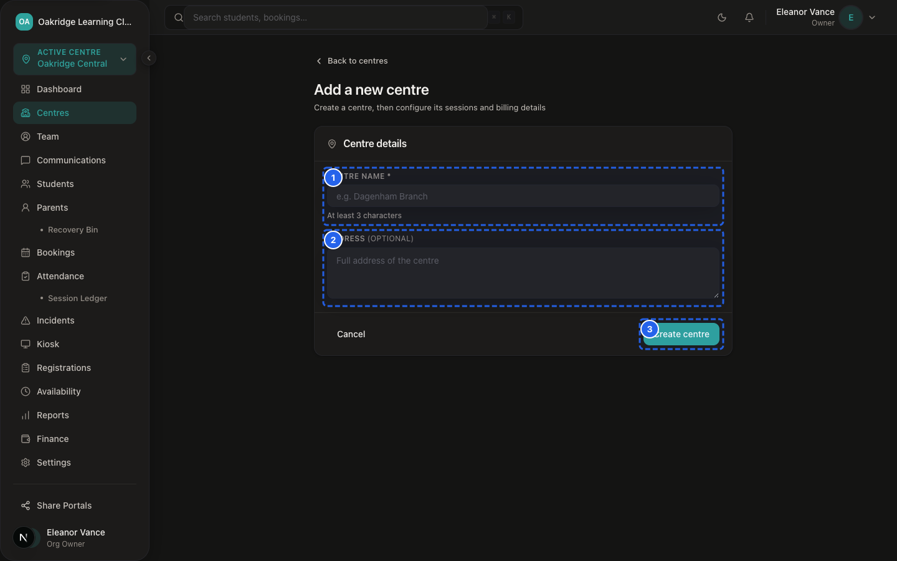
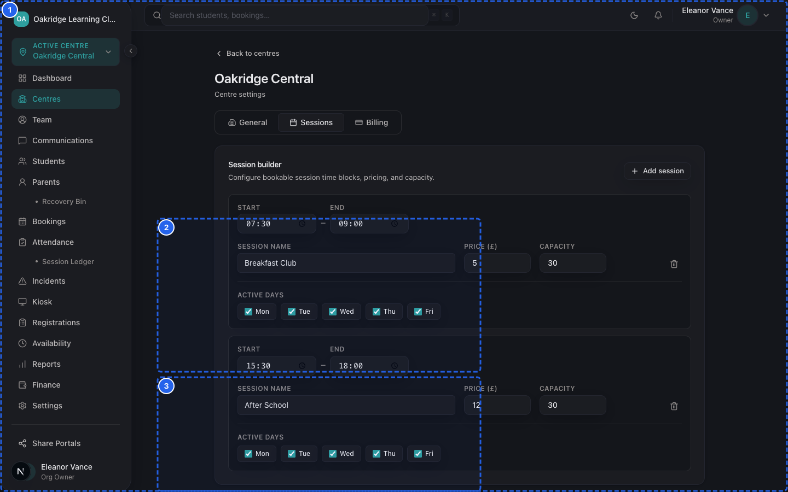
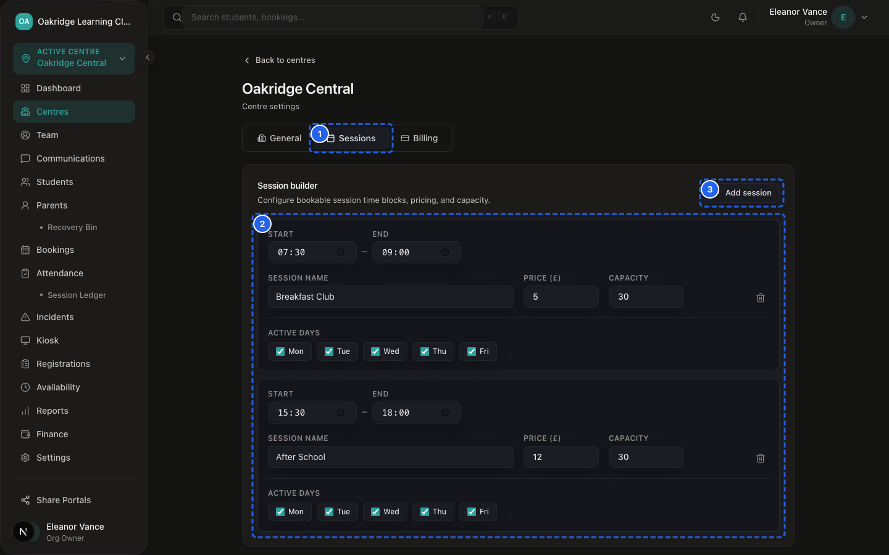
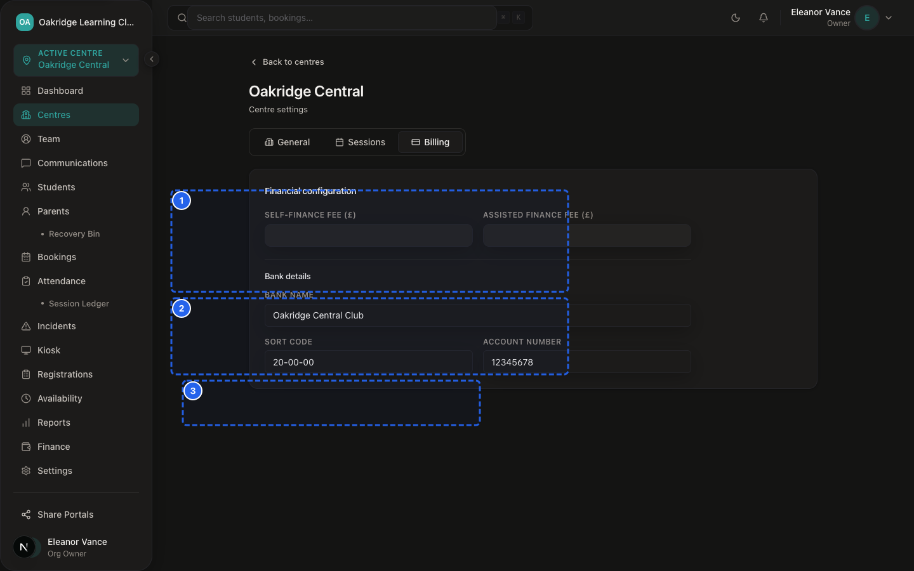

# SprintScale CMS — Functional Manual: Multi-Centre Administration
## Centre Creation, Venue Settings, Bank Details & Multi-Site Access Controls

---

## 1. What Multi-Centre Administration Is

SprintScale CMS allows club operators to manage multiple physical club locations, school sites, or tuition centers under a single Organisation umbrella.

Key Capabilities:
- **Centres Directory:** Overview of all active venues with student counts, staff counts, and operating status.
- **Centre Setup:** Creating new venues with unique URL slugs, addresses, and timezone configurations.
- **Venue Settings & Session Slots:** Customising operating hours, session times (e.g. Early Bird, After School, Twilight), and Ofsted registration IDs.
- **Centre-Specific Bank Details:** Configuring individual bank sort codes and account numbers displayed on parent invoices.
- **Staff Access Scoping:** Assigning Managers, Front Desk staff, and Tutors to specific venues.

---

## 2. Who Can Manage Centres

| Action | Organisation Owner (`ORG_OWNER`) | Centre Manager (`MANAGER`) | Front Desk (`FRONT_DESK`) | Tutor (`TUTOR`) |
|---|---|---|---|---|
| **View Centres Directory (`/dashboard/centres`)** | ✅ All Centres | ✅ Assigned Centres | ✅ Assigned Centres | ❌ Blocked |
| **Create New Centre (`/dashboard/centres/add`)** | ✅ Full Access | ✅ Full Access | ❌ Blocked | ❌ Blocked |
| **Edit General Centre Settings** | ✅ All Centres | ✅ Assigned Centres | ❌ Blocked | ❌ Blocked |
| **Edit Centre Bank & Billing Details** | ✅ **Owner Only** | ❌ Blocked | ❌ Blocked | ❌ Blocked |
| **Assign Staff to Centre** | ✅ Full Access | ❌ Blocked | ❌ Blocked | ❌ Blocked |
| **Delete / Archive Centre** | ❌ Not in UI | ❌ Not in UI | ❌ Not in UI | ❌ Not in UI |

---

## 3. Step-by-Step Procedures

### Procedure 1: Creating a New Centre / Venue


*Figure 13.1 — Multi-Centre Directory*


*Figure 13.2 — New Centre Venue Creation Modal*

📹 **Video Walkthrough:** [Watch: Creating & Setting Up a New Centre Venue](../assets/videos/SS-D6-V020.mp4)
**Who Can Do This:** Organisation Owner (`ORG_OWNER`), Centre Manager (`MANAGER`)

**Steps:**
1. Navigate to: `Sidebar → Centres` (`/dashboard/centres`).
2. Click **+ Add Centre** in the top right.
3. Enter the **Centre Name:** (e.g. "St. Jude's Primary Club" — minimum 3 characters).
4. Enter the **Physical Address:** (e.g. "12 Church Lane, London, SE1 7PB").
5. Click **Create Centre**.
6. The system creates the venue, generates a URL slug (e.g. `st-judes-primary-club-x9y2z`), and redirects directly to the **Centre Settings** page.

---

### Procedure 2: Configuring Centre Settings & Session Slots


*Figure 13.3 — Centre General Settings & Capacity*


*Figure 13.4 — Venue Operating Times Configuration Card*

📹 **Video Walkthrough:** [Watch: Configuring Venue Operating Times](../assets/videos/SS-D6-V046.mp4)
**Who Can Do This:** Organisation Owner, Centre Manager (for assigned centres)

**Steps:**
1. Navigate to: `Sidebar → Centres → [Select Centre] → Settings` (`/dashboard/centres/[id]/settings`).
2. Update **General Details:**
   - **Centre Name**
   - **Physical Address**
   - **Ofsted Registration ID:** (e.g. `EY123456` or `URN 148291`)
3. Configure **Session Slots:** Define standard daily session schedules (e.g. "After School Club", 15:30 – 18:00, Capacity: 30).
4. Click **Save Settings**.

---

### Procedure 3: Configuring Centre Bank & Billing Details


*Figure 13.5 — Centre Bank Details Card (Owner-Only)*

📹 **Video Walkthrough:** [Watch: Managing Centre Bank Account Details](../assets/videos/SS-D6-V021.mp4)
> [!IMPORTANT]
> **Owner-Only Financial Control:**
> Even though Centre Managers can edit general venue settings, **only Organisation Owners can update bank details and tuition rates**.

**Steps:**
1. Log in as an **Organisation Owner** (`ORG_OWNER`).
2. Navigate to: `Sidebar → Centres → [Select Centre] → Settings` (or `/dashboard/centres/[id]/billing`).
3. Scroll to the **Billing & Bank Details** card.
4. Enter:
   - **Bank Name:** (e.g. "Barclays Bank UK")
   - **Sort Code:** (e.g. `20-04-15`)
   - **Account Number:** (e.g. `83920194`)
   - **Standard Self-Financed Hourly Fee (£)**
   - **Assisted / Subsidised Hourly Fee (£)**
5. Click **Save Billing Settings**.

**Expected Result:**
The updated bank details will immediately appear on all newly generated PDF invoices and receipts for families attending this centre.

---

## 4. Multi-Centre Access Scoping & Data Isolation

SprintScale ensures strict separation between venues for non-owner staff:

```
┌─────────────────────────────────────────────────────────────┐
│                    CENTRE ACCESS SCOPING                    │
├─────────────────────────────────────────────────────────────┤
│  • Organisation Owners automatically see data across ALL    │
│    venues in the organisation.                              │
│                                                             │
│  • Managers, Front Desk, and Tutors are restricted to the   │
│    centres listed in their `centreMemberships` record.      │
│                                                             │
│  • Attempting to access an unassigned centre via direct URL │
│    is rejected server-side via `assertCentreAccess`.        │
└─────────────────────────────────────────────────────────────┘
```

---

## 5. Centre Deletion & Dependency Protection

- **No Self-Service Centre Deletion:** SprintScale does not offer a self-service "Delete Centre" button in the UI.
- **Dependency Safeguard:** A physical venue contains extensive historical dependencies — including bookings, attendance registers, incident reports, safeguarding logs, and invoices. Deleting a venue would orphan these statutory compliance records. If a centre closes permanently, staff simply remove staff assignments and leave the historical records intact for auditing.
