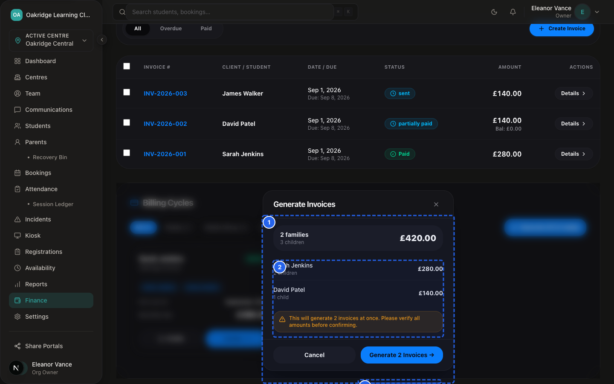
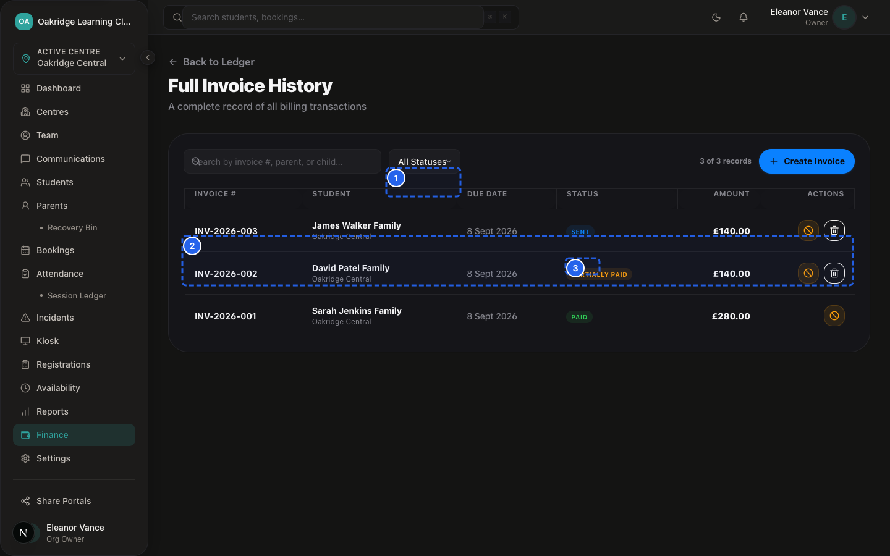
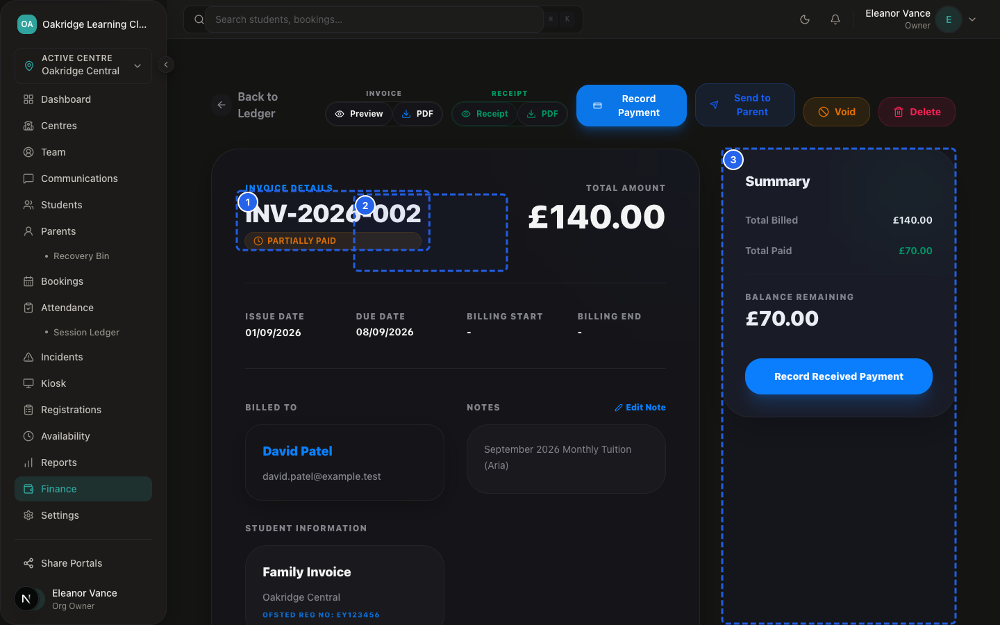
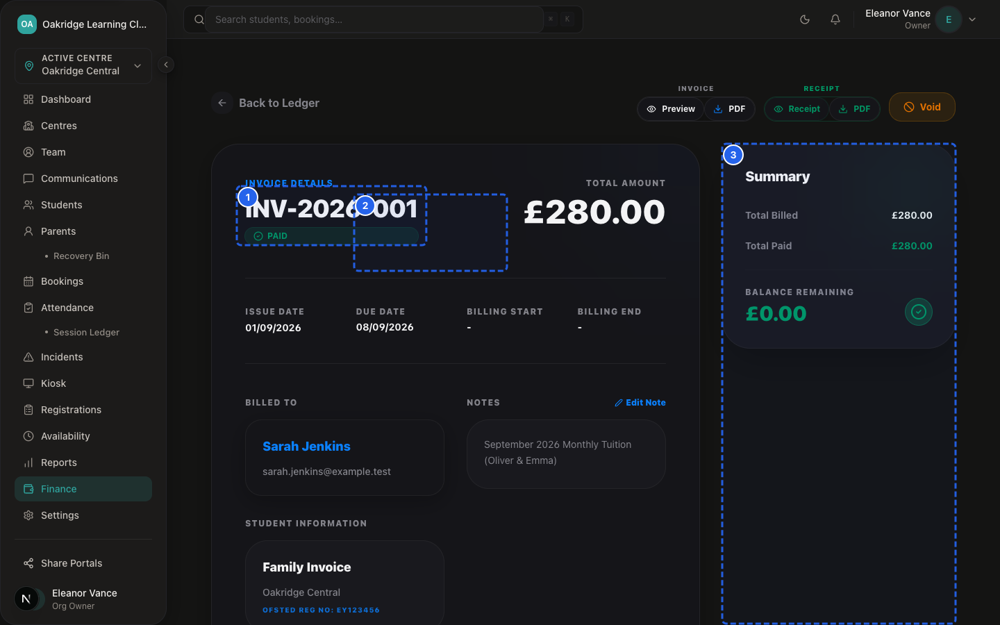
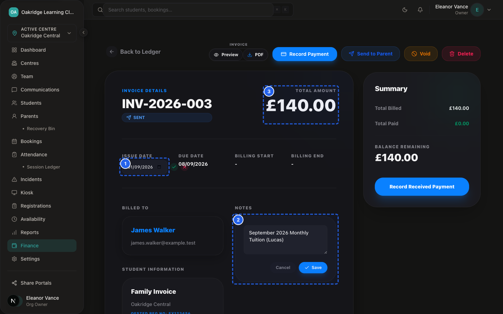
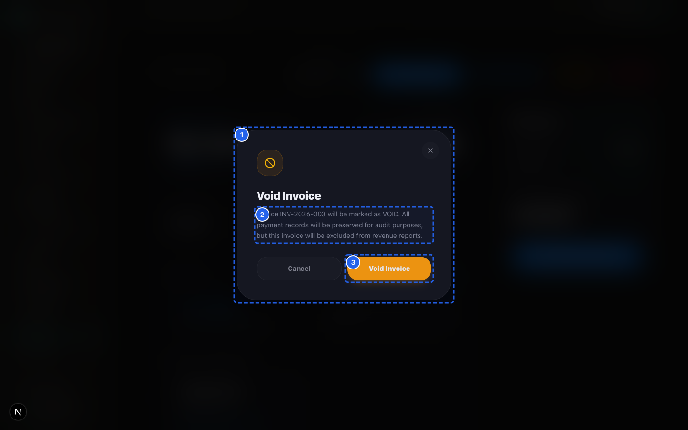

# SprintScale CMS — Functional Manual: Invoices
## Invoice Lifecycle, Monthly Runs, Duplicate Checks, PDF Generation & Voiding Controls

---

## 1. What Invoices Are For

The **Invoices Module** (`/dashboard/finance` and `/dashboard/finance/invoices/[id]`) is the billing document management center for your club organisation.

It enables staff to:
- Review all issued tuition and ad-hoc invoices in a central data grid.
- Execute automated or on-demand monthly invoice runs for active families.
- Generate on-demand PDF invoices with club branding and bank details.
- Update invoice issue dates and administrative notes.
- Dispatch invoice notification emails to parents with direct links to the Parent Portal.
- Void obsolete or cancelled invoices with permanent audit tracking.

---

## 2. Three Ways Invoices Are Created

```
┌─────────────────────────────────────────────────────────────┐
│                 1. AUTOMATED DAILY CRON RUN                 │
│  • Endpoint: `/api/cron/billing` (Runs daily at 6am UTC)    │
│  • Evaluates all active billing configs across the org      │
│  • Computes next billing period based on anchor date & lead │
│  • Auto-generates draft invoice when due                    │
└─────────────────────────────────────────────────────────────┘
                               ▲
┌──────────────────────────────┴──────────────────────────────┐
│                 2. ON-DEMAND CONFIG RUN                     │
│  • Triggered in CMS: `generateInvoiceFromConfig`            │
│  • Staff select billing period start and generate invoice   │
│  • Enforces same application pre-check as automated cron    │
└─────────────────────────────────────────────────────────────┘
                               ▲
┌──────────────────────────────┴──────────────────────────────┐
│                 3. AD-HOC / ONE-OFF INVOICE                 │
│  • Triggered via: `Sidebar → Finance → + Create Invoice`    │
│  • Custom amounts, flexible dates, single or legacy parents │
│  • Useful for registration fees, one-off trips, or uniform  │
└─────────────────────────────────────────────────────────────┘
```

---

## 3. Duplicate Prevention & Billing Run Logging


*Figure 11.1 — Monthly Invoicing Batch Run Preview*

📹 **Video Walkthrough:** [Watch: Executing Monthly Invoicing Batch Run](../assets/videos/SS-D6-V014.mp4)

To protect against duplicate billing:

1. **The `billingRuns` Audit Table:** Whenever a monthly invoice is generated from a billing configuration, SprintScale records an entry in the `billingRuns` table with `(billingConfigId, periodStart, periodEnd, invoiceId, amountPence, success)`.
2. **Application Pre-Check:** Before creating an invoice, both the cron job and the manual action perform an application pre-check querying `billingRuns` for a matching `billingConfigId` and `periodStart`.
3. **Rejection of Duplicate Runs:** If a successful run already exists for that period, the system halts generation and returns `skipped_already_exists`. *(Note: Protection is enforced via application pre-checks rather than a compound database constraint; staff should avoid running concurrent manual invoice batches simultaneously).*

---

## 4. Invoice Status Lifecycle


*Figure 11.2 — Invoices Directory & Status Overview*


*Figure 11.3 — Partial Payment Invoice State*

```
┌─────────────────────────────────────────────────────────────┐
│                   INVOICE STATUS LIFECYCLE                  │
├─────────────────────────────────────────────────────────────┤
│  • `draft`: Newly generated invoice; editable/review state  │
│  • `sent`: Dispatched to parent via email or portal         │
│  • `partially_paid`: Payment recorded, but balance remains  │
│  • `paid`: Full invoice amount settled via verified payments│
│  • `void`: Cancelled by Owner; permanently archived         │
└─────────────────────────────────────────────────────────────┘
```

---

## 5. Step-by-Step Procedures

### Procedure 1: Creating a Custom / Ad-Hoc Invoice
**Who Can Do This:** Organisation Owner, Centre Manager, Front Desk (for assigned centres)

**Steps:**
1. Navigate to: `Sidebar → Finance` (`/dashboard/finance`).
2. Click **+ Create Invoice** (or `+ Ad-Hoc Invoice`).
3. Select the **Centre** and the **Parent** (or enter new parent details).
4. Select the **Child / Children** covered by the invoice.
5. Enter the **Total Amount (£):** e.g. `150.00`.
6. Set the **Invoice Issue Date** and **Due Date**.
7. (Optional) Set the **Billing Period Start & End Dates**.
8. Enter custom **Notes** (e.g. "Term 1 STEM Club registration and materials").
9. Click **Create Invoice**.

**Expected Result:**
The invoice is generated with a unique reference number (e.g. `INV-A1B2C3`), initial status is set to `draft`, an audit event is logged, and an email notification is dispatched to the parent.

---

### Procedure 2: Viewing and Downloading an Invoice PDF


*Figure 11.4 — Detailed Invoice View & Payment Audit Log*
**Who Can Do This:** Organisation Owner, Centre Manager, Front Desk, Parent (via Portal)

**Steps:**
1. Open the invoice details page: `/dashboard/finance/invoices/[id]`.
2. In the top action bar, click **Preview** to view the invoice in a modal.
3. Click **PDF** to download the formatted PDF document (`Invoice-INV-XXXXXX.pdf`).
4. The PDF automatically includes your organisation name, centre address, bank sort code & account number, covered children, and payment instructions.

---

### Procedure 3: Updating Invoice Date or Administrative Notes


*Figure 11.5 — Invoice Date & Notes Editing Form*

📹 **Video Walkthrough:** [Watch: Editing Invoice Issue Date & Notes](../assets/videos/SS-D6-V044.mp4)
**Who Can Do This:** Organisation Owner, Centre Manager, Front Desk (for assigned centres)

**Steps:**
1. Open the invoice details page (`/dashboard/finance/invoices/[id]`).
2. **To Update Issue Date:** Click the edit icon next to the Issue Date, select the corrected date, and click **Save**.
3. **To Update Notes:** Click the edit icon next to Notes, enter updated instructions, and click **Save Notes**.

**Expected Result:**
The invoice updates immediately, the changes appear on the live PDF, and an audit event (`invoice_date_updated` / `invoice_notes_updated`) is recorded.

---

### Procedure 4: Voiding an Invoice


*Figure 11.6 — Owner Invoice Voiding Confirmation Modal*

📹 **Video Walkthrough:** [Watch: Voiding an Incorrect Invoice](../assets/videos/SS-D6-V018.mp4)
> [!IMPORTANT]
> **Owner-Restricted Capability:**
> Only users with the **Organisation Owner** (`ORG_OWNER`) role can void invoices. Voiding cancels the invoice liability in the Parent Portal. Voiding cannot be reversed in the UI.

**Steps:**
1. Open the invoice at `/dashboard/finance/invoices/[id]`.
2. In the top action bar, click **Void Invoice**.
3. In the confirmation dialog, review the warning and click **Confirm Void**.
4. Status transitions to `void`. The outstanding balance drops to £0.00 in the parent portal, and the invoice is displayed with a strikethrough.

---

### Procedure 5: Deleting an Invoice (Zero-Payment Protection)
**Who Can Do This:** **Organisation Owner** (`ORG_OWNER`) Only

**Steps:**
1. Open the invoice at `/dashboard/finance/invoices/[id]`.
2. Click **Delete Invoice**.
3. **Safety Protection:** If any payments have been recorded against the invoice, the system **blocks deletion** with the error: *"Please delete associated payments before deleting the invoice."*
4. If no payments exist, confirm deletion. The record is removed from the database.

---

### Procedure 6: Resending Invoice Notification Email
**Who Can Do This:** **Organisation Owner** (`ORG_OWNER`) Only

**Steps:**
1. Open the invoice at `/dashboard/finance/invoices/[id]`.
2. Click **Resend Email**.
3. The system sends an email notification with the invoice summary and portal link to the parent's registered email address.
4. (Note: Resending is blocked if the invoice is already `paid` or `void`).

---

## 6. Invoices Troubleshooting

| Issue | Cause | Solution |
|---|---|---|
| **Invoice run gives "Invoice already generated for period"** | Application pre-check in `billingRuns` prevented duplicate invoice creation. | Check the invoice history. The invoice for this billing period already exists in the system. |
| **Manager cannot find Void or Delete buttons** | Voiding and deleting are restricted by design to the Organisation Owner. | Request the Organisation Owner to review and void the invoice. |
| **Parent cannot see newly created invoice** | Invoice was created under a different parent account or different organisation. | Verify parent account email matching on the invoice details screen. |
| **Invoice shows wrong bank account details on PDF** | Centre billing details have not been configured. | Owner must configure bank details at `Sidebar → Centres → [Centre] → Billing`. |
