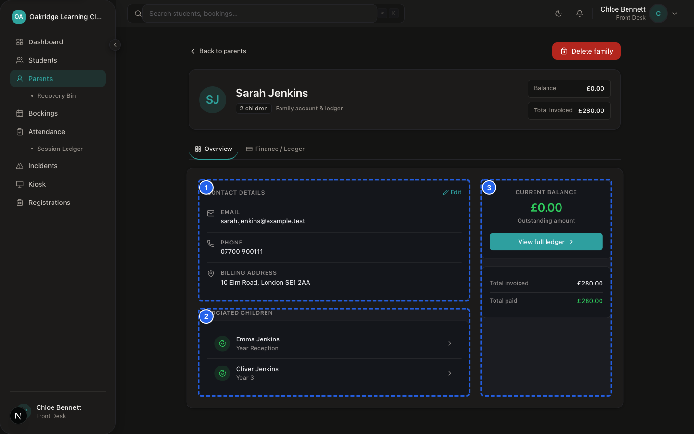
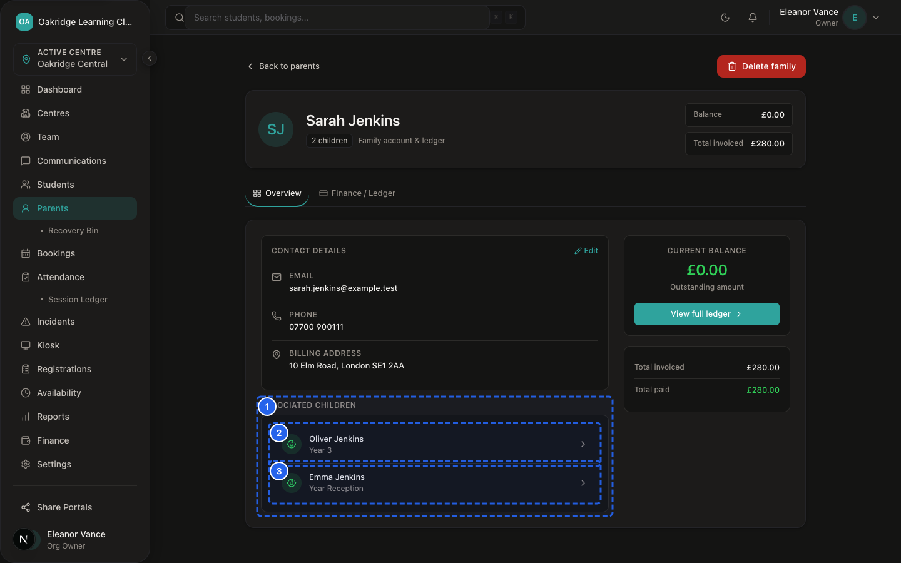
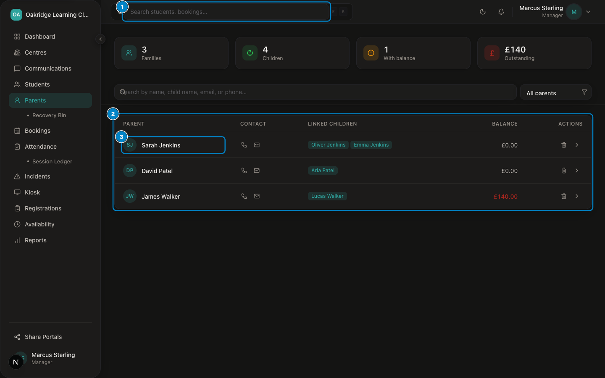
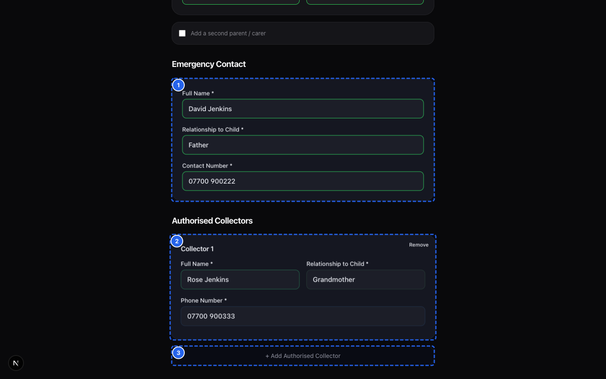

# SprintScale CMS — Functional Manual: Parents
## Family Account Management, Contact Records & Privacy Manual

---

## 1. What This Module Is For

The **Parents Module** manages primary billing contacts, legal guardians, and adult family profiles across your club organisation.

It enables staff to:
- Maintain authoritative contact details (email, telephone, postal address, preferred contact method).
- View all linked children/students across multi-sibling households.
- Track explicit UK GDPR communications consent.
- Link parents to invoices, monthly billing configurations, and payment histories.
- Safely archive departed families via a 30-day **Recovery Bin**, with Owner-only permanent erasure controls.

---

## 2. Who Can Use It (Role Permissions)

| User Role | Directory Access (`/dashboard/parents`) | Profile Detail (`/dashboard/parents/[id]`) | Add / Edit Parent | Soft Delete / Restore | Permanent GDPR Purge |
|---|---|---|---|---|---|
| **Owner** (`ORG_OWNER`) | ✅ Full (All Centres) | ✅ Full Access | ✅ Full Access | ✅ Full Access | ✅ Full Access |
| **Manager** (`MANAGER`) | ✅ Centre-Scoped | ✅ Centre-Scoped | ✅ Centre-Scoped | ✅ Centre-Scoped | ❌ No Access |
| **Front Desk** (`FRONT_DESK`)| ✅ Centre-Scoped | ✅ Centre-Scoped | ✅ Centre-Scoped | ✅ Centre-Scoped | ❌ No Access |
| **Tutor** (`TUTOR`) | ❌ No Access | ❌ No Access | ❌ No Access | ❌ No Access | ❌ No Access |
| **Parent** (Consumer Auth) | ❌ No Access | ❌ No Access | ❌ No Access | ❌ No Access | ❌ No Access |

> [!NOTE]
> Parents do not access the internal staff directory. Parents manage their own profile, emergency contacts, and linked children through the passwordless **Parent Portal** (`/portal`).

---

## 3. Parent Record Anatomy

A complete parent profile in SprintScale CMS contains the following data structures:

```
┌─────────────────────────────────────────────────────────────┐
│                    PARENT PROFILE ANATOMY                   │
├─────────────────────────────────────────────────────────────┤
│  • Identity: First Name, Last Name, Relationship to Child   │
│  • Contact: Email Address, Mobile Phone, Preferred Method   │
│  • Residential Address: Line 1, Line 2, City, Postcode      │
│  • GDPR Preferences: Communications & Marketing Consent     │
│  • Linked Children: Enrolled sibling cards with school year │
│  • Inbound Registrations: Historical application forms      │
│  • Financial Profile: Stripe Customer ID, Billing Config    │
│  • Status: Active / Archived (DeletedAt timestamp)          │
└─────────────────────────────────────────────────────────────┘
```

---

## 4. Viewing, Searching & Filtering Parents

### Procedure: Finding and Opening a Parent Record


*Figure 2.2 — Parent Profile & Emergency Contact Cards with contact hierarchy*


*Figure 2.3 — Multi-Child Family Sibling Linkage View on parent profile*

📹 **Video Walkthrough:** [Watch: Adding a Sibling to an Existing Family](../assets/videos/SS-D6-V034.mp4)
**Who Can Do This:** Owner, Manager, Front Desk

**Before You Start:**
- Ensure you have signed into `/dashboard` and selected your active Centre.

**Steps:**
1. Navigate to: `Sidebar → Parents` (`/dashboard/parents`).
2. The directory displays the parent list with columns: **Name**, **Email**, **Phone**, **Linked Children**, and **Actions**.


*Figure 2.1 — Parent Directory Roster showing parent contact status and linked children*

📹 **Video Walkthrough:** [Watch: Adding a New Parent Manually](../assets/videos/SS-D6-V033.mp4)
3. To search: Type the parent's first name, last name, or email address into the **Search Parents** input field. The table filters in real time.
4. Click on the parent's row or click **View Profile** to open their dedicated profile page (`/dashboard/parents/[id]`).

**Expected Result:**
The complete parent record opens, displaying contact information, linked sibling cards, recent registrations, and family billing summaries.

---

## 5. Adding a New Parent Manually

**Who Can Do This:** Owner, Manager, Front Desk

**Before You Start:**
- Verify that the parent does not already exist in the directory (search by email to prevent duplicate accounts).

**Steps:**
1. Navigate to: `Sidebar → Parents → [+ Add Parent]` (or via `Sidebar → Students → Add Student`).
2. In the modal, enter:
   - **First Name** and **Last Name** (Required)
   - **Email Address** (Required for Parent Portal access & invoicing)
   - **Phone Number** (e.g. `+44 7700 900123`)
   - **Relationship to Child** (e.g. `Mother`, `Father`, `Guardian`, `Carer`)
   - **Preferred Contact Method** (`Email`, `Phone`, or `SMS`)
   - **Address Details** (Address Line 1, City, Postcode)
3. Click **Save Parent**.

**Expected Result:**
The parent record is created immediately and assigned to your organisation. You can now attach children or create bookings for this parent.

---

## 6. Authorised Pick-Up Collector Protocols

Authorised collectors are trusted adults explicitly designated by custodial parents to collect pupils at dismissal.


*Figure 2.4 — Authorised Collector Details captured during registration review*

📹 **Video Walkthrough:** [Watch: Entering Authorised Pick-Up Collector Details During Registration](../assets/videos/SS-D6-V035.mp4)

## 7. Editing Parent Details & Communications Consent

**Who Can Do This:** Owner, Manager, Front Desk

**Steps:**
1. Open the parent's profile: `Sidebar → Parents → [Select Parent]`.
2. Click **Edit Parent Details**.
3. Update the relevant contact fields or address information.
4. Under **GDPR & Communications**, review the **Marketing & Broadcast Consent** toggle.
5. Click **Save Changes**.

> [!IMPORTANT]
> If a parent withdraws communications consent, toggle the consent switch to **Off**. The system will immediately exclude their email address from bulk announcement broadcasts in `Sidebar → Communications`.

---

## 7. Linking Parents and Children (Multi-Sibling Households)

SprintScale connects multiple children to a single primary parent record to support family billing and consolidated notifications.

- **During Registration:** When a parent submits a multi-child registration form, the system automatically resolves or creates the parent and attaches all submitted children under `children.parentId`.
- **Manual Linking:** When adding a new child via `Sidebar → Students → Add Student`, select the existing parent from the **Select Parent** searchable dropdown.

---

## 8. Archiving / Deleting a Parent (Soft Delete)

> [!NOTE]
> SprintScale uses a **30-day Soft-Delete model**. Deleting a parent does not instantly erase their legal records; it moves them to the **Recovery Bin**.

**Who Can Do This:** Owner, Manager, Front Desk

**Steps:**
1. Open: `Sidebar → Parents → [Select Parent]`.
2. Scroll to the bottom of the profile page and click **Archive Parent** (or click the trash icon in the directory table).
3. In the confirmation dialog, review the warning stating that all associated child records will be archived from active roll calls.
4. Click **Confirm Archive**.

**Expected Result:**
The parent is marked as deleted (`parents.deletedAt` timestamp set) and removed from the active directory, bookings schedule, and roll-call registers.

---

## 9. Restoring from the Recovery Bin

**Who Can Do This:** Owner, Manager, Front Desk

**Steps:**
1. Navigate to: `Sidebar → Parents → Recovery Bin` (`/dashboard/parents/bin`).
2. Locate the archived parent in the list.
3. Click **Restore**.
4. The system clears `deletedAt` and immediately restores the parent and their linked children to the active directory.

---

## 10. Permanent GDPR Purge (Owner Only)

> [!CAUTION]
> **Permanent Purge is completely irreversible.** It permanently erases the parent's contact records, address, and profile links from the database to satisfy UK GDPR "Right to Erasure" requests.

**Who Can Do This:** **Organisation Owner Only** (`ORG_OWNER`)

**Steps:**
1. Navigate to: `Sidebar → Parents → Recovery Bin` (`/dashboard/parents/bin`).
2. Locate the archived record.
3. Click **Permanent Purge**.
4. In the security modal, type `DELETE` to confirm.
5. Click **Permanently Erase Record**.

---

## 11. Troubleshooting & Edge Cases

| Issue | Root Cause | Solution |
|---|---|---|
| **Parent cannot be found in search** | Parent was archived or registered under a different spelling/email. | Check `Sidebar → Parents → Recovery Bin` to see if the record was archived, or search by phone number. |
| **Two duplicate records exist for the same parent** | Parent registered twice with different email variations (e.g. work vs personal). | Open the secondary record, verify which children are attached, update children's parent links to the primary record, then archive the secondary record. |
| **Parent did not receive broadcast email** | Parent has not given communications consent or email had a delivery bounce. | Open parent profile, check the **Communications Consent** flag, and verify the email address. |

---

## 12. Operational Rationale: Why SprintScale Works This Way

1. **Separation of Parent and Child:** Adults hold the legal, financial, and contractual responsibility, while children attend classroom sessions. Separating them allows one parent to manage multiple siblings seamlessly.
2. **Soft-Delete Safety Net:** Childcare organisations are subject to statutory record retention rules. The 30-day Recovery Bin prevents accidental loss of emergency records while complying with GDPR erasure protocols.
