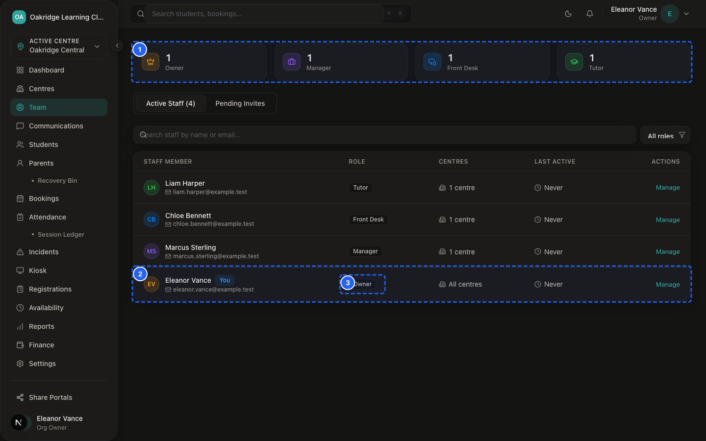
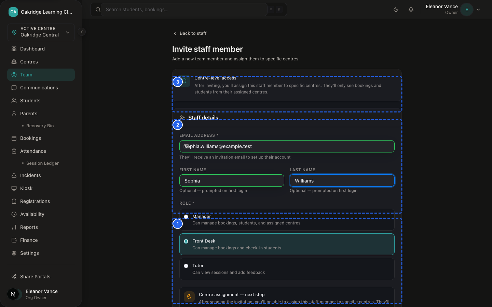
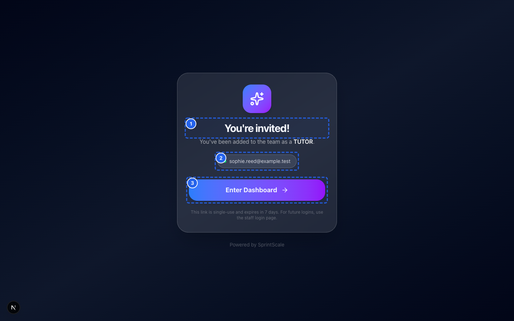
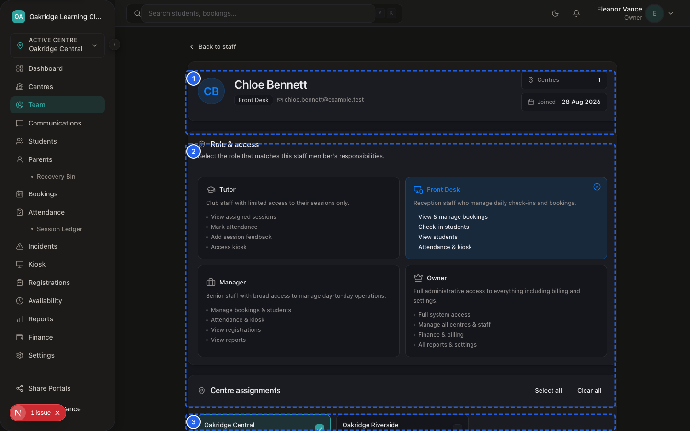
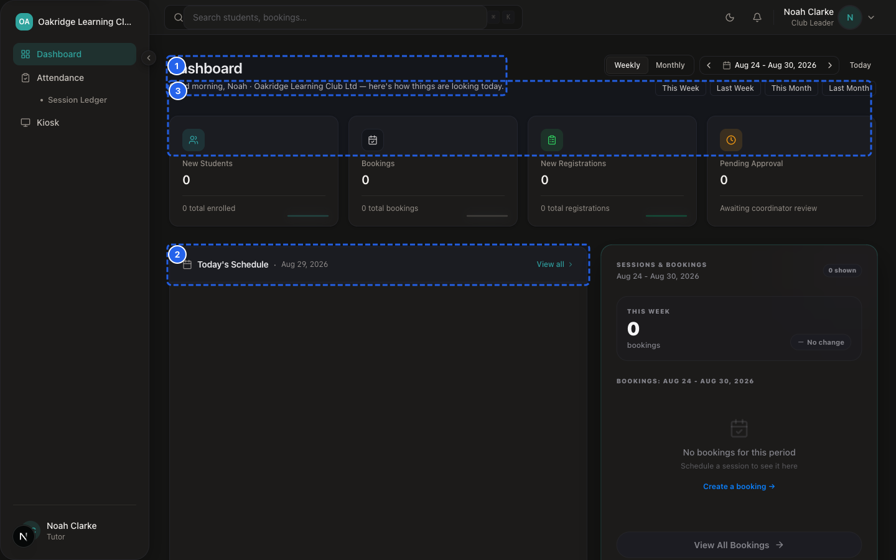
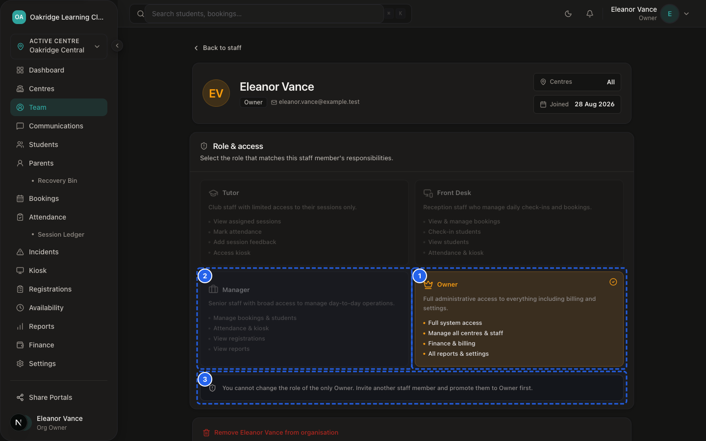
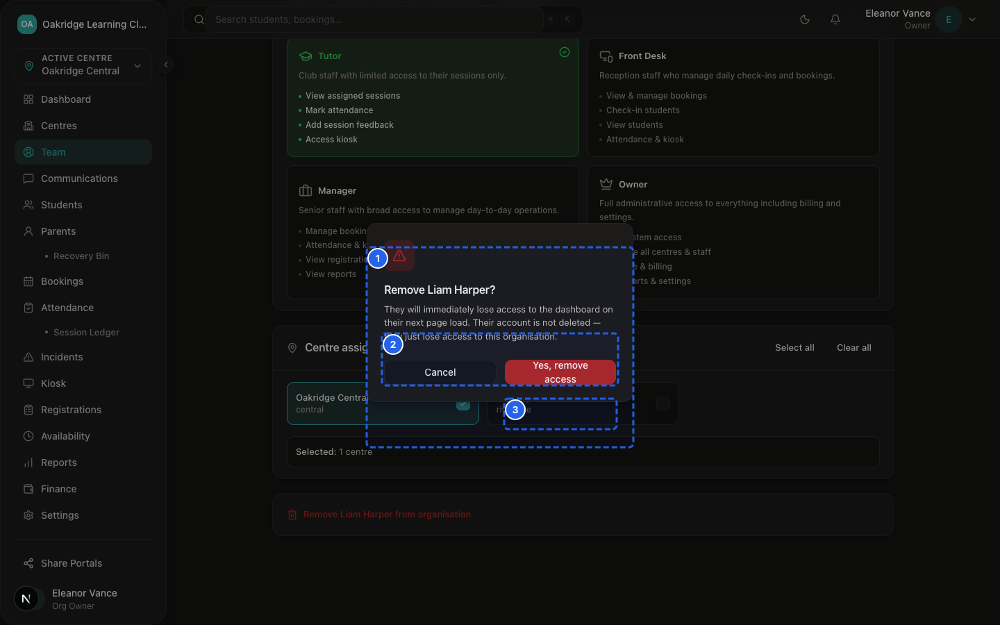

# SprintScale CMS — Functional Manual: Staff Directory & Access Permissions
## Staff Management, Invitations, Role Assignment, Centre Memberships & Access Removal

---

## 1. What Staff Management Is

*Figure 14.1 — Staff Directory Roster*

The **Staff Module** (`/dashboard/staff` and `/dashboard/staff/invite`) allows Organisation Owners to build their team, assign operational roles, control venue access, and safely remove staff credentials.

Key Capabilities:
- **Staff Directory:** Central roster of all active team members, their roles, email addresses, and assigned centres.
- **Secure Email Invitations:** Inviting new staff with single-use cryptographic invitation tokens sent via Resend.
- **Role Assignment:** Upgrading or changing staff privileges across the four distinct system roles.
- **Centre Memberships:** Scoping staff members to one, multiple, or all venues.
- **Safe Staff Deactivation:** Revoking staff access immediately without destroying historical attendance, audit, or incident attribution.

---

## 2. Server-Side Role & Permission Matrix

SprintScale enforces strict server-side authorization across all modules:

| System Capability | Owner (`ORG_OWNER`) | Manager (`MANAGER`) | Front Desk (`FRONT_DESK`) | Tutor (`TUTOR`) |
|---|---|---|---|---|
| **Global Finance & Invoices (`/dashboard/finance`)** | ✅ Full Access | ❌ Blocked | ❌ Blocked | ❌ Blocked |
| **Centre Invoices & Offline Payments** | ✅ All Centres | ✅ Assigned Centres | ✅ Assigned Centres | ❌ Blocked |
| **Void / Delete Invoices** | ✅ **Owner Only** | ❌ Blocked | ❌ Blocked | ❌ Blocked |
| **Staff Directory (`/dashboard/staff`)** | ✅ View / Manage | ✅ View Only | ❌ Blocked | ❌ Blocked |
| **Invite Staff (`/dashboard/staff/invite`)** | ✅ **Owner Only** | ❌ Blocked | ❌ Blocked | ❌ Blocked |
| **Change Staff Roles / Remove Staff** | ✅ **Owner Only** | ❌ Blocked | ❌ Blocked | ❌ Blocked |
| **Create New Centre (`/dashboard/centres/add`)** | ✅ Full Access | ✅ Full Access | ❌ Blocked | ❌ Blocked |
| **Edit Centre General Settings** | ✅ All Centres | ✅ Assigned Centres | ❌ Blocked | ❌ Blocked |
| **Edit Centre Bank & Billing Details** | ✅ **Owner Only** | ❌ Blocked | ❌ Blocked | ❌ Blocked |
| **Student Directory & Medical Profiles** | ✅ All Centres | ✅ Assigned Centres | ✅ Assigned Centres | ✅ Assigned (View) |
| **Public Registrations & Intake Triage** | ✅ All Centres | ✅ Assigned Centres | ✅ Assigned Centres | ❌ Blocked |
| **Daily Attendance & Tablet Kiosk** | ✅ All Centres | ✅ Assigned Centres | ✅ Assigned Centres | ✅ Assigned (Live) |
| **Session Credit Ledger (`/ledger`)** | ✅ All Centres | ✅ Assigned Centres | ❌ Blocked | ❌ Blocked |
| **Standard Incident & First Aid Logging** | ✅ All Centres | ✅ Assigned Centres | ✅ Assigned Centres | ✅ Assigned Centres |
| **Restricted Safeguarding Records (DSL)** | ✅ Full Access | ✅ Assigned Centres | ❌ Blocked | ❌ Blocked |
| **Parent Broadcasts (`/communications`)** | ✅ All Centres | ✅ Assigned Centres | ❌ Blocked | ❌ Blocked |
| **GDPR Organisation Export (`/settings`)** | ✅ **Owner Only** | ❌ Blocked | ❌ Blocked | ❌ Blocked |
| **Recovery Bin View & Family Restore** | ✅ Full Access | ✅ Full Access | ✅ Full Access | ❌ Blocked |
| **Permanent Purge (`hardDeleteParent`)** | ✅ **Owner Only** | ❌ Blocked | ❌ Blocked | ❌ Blocked |

---

## 3. Step-by-Step Procedures

### Procedure 1: Inviting a New Staff Member

*Figure 14.2 — Staff Invitation Modal*

📹 **Video Walkthrough:** [Watch: Inviting a New Staff Member via Email](../assets/videos/SS-D6-V022.mp4)

*Figure 14.3 — Staff Invite Acceptance Screen*

📹 **Video Walkthrough:** [Watch: Accepting a Staff Email Invitation](../assets/videos/SS-D6-V023.mp4)
**Who Can Do This:** Organisation Owner (`ORG_OWNER`) Only

**Steps:**
1. Navigate to: `Sidebar → Staff` (`/dashboard/staff`).
2. Click **+ Invite Staff Member** (or go to `/dashboard/staff/invite`).
3. Enter the staff member's **Email Address**, **First Name**, and **Last Name**.
4. Select their **Role:** `MANAGER`, `FRONT_DESK`, or `TUTOR`.
5. (Optional) Select their initial **Assigned Centre**.
6. Click **Send Invitation**.

**What Happens in the System:**
- A raw 32-byte cryptographic token is generated.
- The SHA-256 hash of the token is stored in the `staffInvites` table with a 7-day expiration timestamp.
- An email invitation containing the secure link (`/accept-invite?token=...`) is dispatched via Resend.
- The user account is provisioned and linked to the organisation and selected centre.

---

### Procedure 2: Assigning Centres to an Existing Staff Member

*Figure 14.4 — Staff Centre Membership Selection Form*

📹 **Video Walkthrough:** [Watch: Scoping Staff Access Across Specific Centres](../assets/videos/SS-D6-V024.mp4)

*Figure 14.5 — Zero-Centre Assigned Staff Empty State*

📹 **Video Walkthrough:** [Watch: Handling Zero-Centre Staff Assignment](../assets/videos/SS-D6-V051.mp4)
**Who Can Do This:** Organisation Owner (`ORG_OWNER`) Only

**Steps:**
1. Navigate to: `Sidebar → Staff` (`/dashboard/staff`).
2. Click on the staff member's name to open their profile (`/dashboard/staff/[userId]`).
3. In the **Centre Memberships** section, check the boxes next to all venues the staff member should access.
4. Click **Save Centre Assignments**.

**Expected Result:**
The system updates `centreMemberships`. The next time the staff member logs in or refreshes their dashboard, their centre selector and records will reflect the new venue assignments.

---

### Procedure 3: Changing a Staff Member's Role

*Figure 14.6 — Self-Demotion Guard Modal*

📹 **Video Walkthrough:** [Watch: Updating Staff Role & Privileges](../assets/videos/SS-D6-V025.mp4)
**Who Can Do This:** Organisation Owner (`ORG_OWNER`) Only

**Steps:**
1. Open the staff member's profile at `/dashboard/staff/[userId]`.
2. Locate the **Role & Permissions** card.
3. Select the new role from the dropdown (`MANAGER`, `FRONT_DESK`, `TUTOR`, or `ORG_OWNER`).
4. Click **Update Role**.

---

### Procedure 4: Removing / Deactivating a Staff Member

*Figure 14.7 — Staff Deactivation Modal*

📹 **Video Walkthrough:** [Watch: Safely Deactivating a Staff Member](../assets/videos/SS-D6-V026.mp4)
**Who Can Do This:** Organisation Owner (`ORG_OWNER`) Only

**Steps:**
1. Open the staff member's profile at `/dashboard/staff/[userId]`.
2. Click **Remove Staff Member** (red button).
3. In the confirmation modal, review the warning and click **Confirm Removal**.

**What Happens in the System:**
- The system verifies the target user is not an active `ORG_OWNER` (Owners must be demoted first).
- All `centreMemberships` for that user are deleted.
- The user's `organisationId` in the `users` table is set to `null` (detaching them from the organisation).
- On the user's next session check or authenticated request, `requireAuth` detects `session.user.organisationId == null` and blocks dashboard access immediately.

---

## 4. Preservation of Historical Attribution

SprintScale strictly enforces data preservation upon staff departure:

> [!IMPORTANT]
> **Historical Record Integrity:**
> Removing a staff member **never deletes** historical attendance marks, daily roll call sign-ins, first aid logs, safeguarding entries, or financial payment records created by that person. The user's historical ID remains recorded in `auditEvents` and relational tables to satisfy statutory and Ofsted audit requirements.
