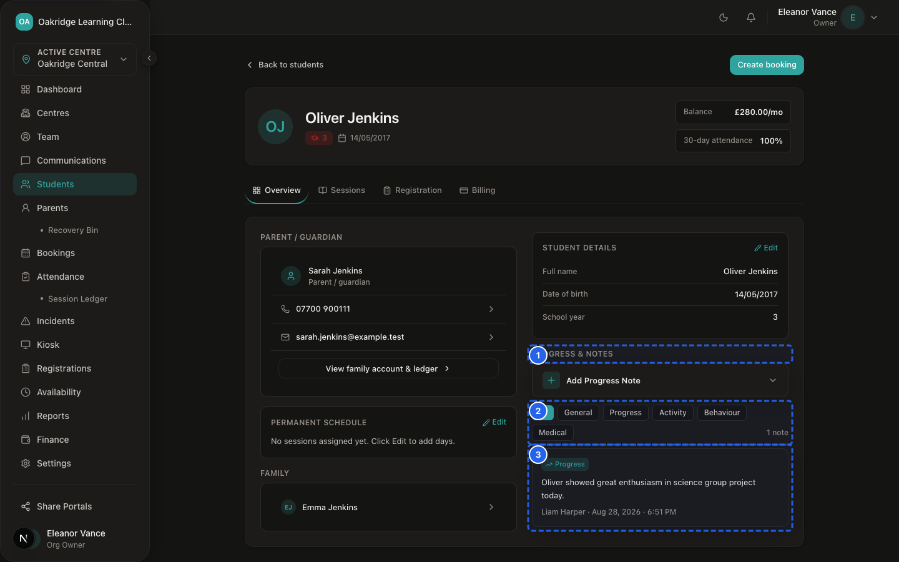

# SprintScale CMS — Functional Manual: Student Records & Notes
## Classroom Progress Timelines, Operational Flags, Scorecards & Record Boundaries

---

## 1. What Student Records & Notes Contain

The **Student Records & Notes Module** maintains the day-to-day educational, behavioural, medical, and progress documentation for enrolled children.

It unifies four distinct information categories:
1. **Operational Demographics:** Pupil name, birthdate, school year group, enrolled school, and family billing links.
2. **Medical & Allergy Profiles:** Medical condition alerts, food allergies, dietary restrictions, and doctor surgery contacts.
3. **Classroom Notes & Operational Flags:** Real-time homework completion toggles, positive behaviour acknowledgments, and internal tutor handovers.
4. **Academic Progress & Scorecards:** Session assessment ratings, constructive written feedback, and photo/worksheet attachments.

---

## 2. Who Can Use Them (Role Permissions)

| Record / Feature Area | Owner (`ORG_OWNER`) | Manager (`MANAGER`) | Front Desk (`FRONT_DESK`) | Tutor (`TUTOR`) | Parent (`PARENT`) |
|---|---|---|---|---|---|
| **View Student Profile 360°** | ✅ Full Access | ✅ Centre-Scoped | ✅ Centre-Scoped | ❌ No Access (Roll Call View)| ✅ Own Children |
| **Edit Student Demographics** | ✅ Full Access | ✅ Centre-Scoped | ✅ Centre-Scoped | ❌ No Access | ❌ No Access |
| **Edit Medical & Allergies** | ✅ Full Access | ✅ Centre-Scoped | ✅ Centre-Scoped | ❌ No Access (View Badges) | ✅ Update via Portal |
| **Toggle Homework/Behaviour Flags**| ✅ Full Access | ✅ Full Access | ✅ Full Access | ✅ Full Access | ❌ No Access |
| **Add Internal Staff Note** | ✅ Full Access | ✅ Centre-Scoped | ✅ Centre-Scoped | ✅ Session Notes | ❌ No Access |
| **Create Progress Scorecard Draft**| ✅ Full Access | ✅ Full Access | ✅ Full Access | ✅ Full Access | ❌ View Sent Only |
| **Send Scorecard to Parent** | ✅ Full Access | ✅ Centre-Scoped | ✅ Centre-Scoped | ❌ Needs Approval | ✅ Receives via Email |

---

## 3. Strict Boundary: Ordinary Notes vs. Restricted Safeguarding

> [!WARNING]
> **RECORD BOUNDARY DIRECTIVE:**
> **SAFEGUARDING CONCERNS MUST NOT BE ENTERED INTO ORDINARY STUDENT NOTES.**
>
> Ordinary student notes are visible to on-duty classroom tutors, front-desk staff, and managers for day-to-day operational handovers.
> In contrast, sensitive child protection disclosures or welfare concerns must be recorded in the restricted **Safeguarding** section of `/dashboard/incidents`, accessible only to Manager and Owner roles.

```
┌─────────────────────────────────────────────────────────────┐
│                 ORDINARY STUDENT RECORDS & NOTES            │
│  • Homework Completion & Reading Logs                       │
│  • Positive Classroom Behaviour & Achievement Notes         │
│  • Assessment Scorecards & Progress Feedback                │
│  • General Operational Handovers ("Forgot jacket")          │
│  ► Visible to: All on-duty Tutors, Front Desk & Managers    │
└──────────────────────────────┬──────────────────────────────┘
                               │  SOFTWARE ACCESS SEPARATION
┌──────────────────────────────▼──────────────────────────────┐
│             RESTRICTED SAFEGUARDING INCIDENTS               │
│  • Disclosures, sensitive welfare concerns, injury marks    │
│  • Logged under: `/dashboard/incidents` (Type: Safeguarding)│
│  ► Visible ONLY to: Managers & Organisation Owners          │
└─────────────────────────────────────────────────────────────┘
```

---

## 4. Step-by-Step Procedures

### Procedure 1: Logging an Internal Classroom Note


*Figure 8.1 — Student Classroom Note Entry Form*

📹 **Video Walkthrough:** [Watch: Logging Student Homework & Progress Notes](../assets/videos/SS-D6-V037.mp4)
**Who Can Do This:** Owner, Manager, Front Desk, Tutor

**Steps:**
1. Navigate to: `Sidebar → Students → [Select Student]`.
2. Scroll to the **Internal Notes Timeline** tab.
3. Click **+ Add Note**.
4. Select the Note Category: `General`, `Academic`, `Behaviour`, or `Parent Communication`.
5. Enter factual, professional notes (e.g. "Completed Level 3 reading comprehension task with 90% accuracy").
6. Click **Save Note**.
7. The note is timestamped with your name and added to the timeline.

---

### Procedure 2: Setting Homework & Behaviour Flags on Roll Call
**Who Can Do This:** Owner, Manager, Front Desk, Tutor

**Steps:**
1. Open the live register at `Sidebar → Attendance` (`/dashboard/attendance`).
2. On the student's attendance card, click the **Homework** icon (📚) to toggle active.
3. Click the **Behaviour** icon (⭐) to toggle positive recognition.
4. Enter an optional **Flag Note** (e.g. "Excellent focus during science activity").
5. The flag badge appears immediately on the roll call card for the duration of the session.

---

### Procedure 3: Creating and Sending an Assessment Scorecard


*Figure 8.2 — Student Academic Scorecard & Progress View*
**Who Can Do This:** Owner, Manager, Front Desk, Tutor

**Steps:**
1. Navigate to: `Sidebar → Bookings → [Select Session Booking]`.
2. Locate the student in the **Attendees & Assessment Scorecard** section.
3. Enter the assessment **Score / Grade** (e.g. `88%` or `Advanced`).
4. In the **Feedback Notes** text box, write constructive feedback for the parents.
5. (Optional) Click **Attach Worksheet** to upload a photo of completed coursework.
6. Click **Save Draft** (or click **Send to Parent** if you are authorized to dispatch parent communications).
7. When sent, the parent receives an official PDF progress card via email.

---

## 5. Medical Alert Badges & Special Needs (SEN) Visibility

SprintScale automatically projects medical and SEN indicators directly onto classroom registers and kiosk screens:

- 🔴 **Red Alert Badge (Medical / Severe Allergy):** Displays if the child has recorded medical conditions (e.g. *Asthma*, *EpiPen*, *Severe Nut Allergy*).
- 🟡 **Yellow Alert Badge (Dietary Requirements):** Displays for dietary requirements (e.g. *Halal*, *Kosher*, *Vegetarian*, *Gluten-Free*).
- 🔵 **Blue Alert Badge (SEN Support):** Displays if the child has Special Educational Needs support notes.

---

## 6. Student Records Troubleshooting

| Issue | Cause | Solution |
|---|---|---|
| **Tutor cannot find Student Directory in sidebar** | Tutors are intentionally scoped to Attendance and Kiosk to protect student data privacy. | Tutors view pupil details, medical alerts, and flags directly on `/dashboard/attendance`. |
| **Accidental sensitive disclosure entered in general notes** | Staff member typed a safeguarding disclosure in general notes by mistake. | Report immediately to an appointed Manager to author a restricted safeguarding file in `/dashboard/incidents`, then delete/archive the general note. |
| **Parent cannot see assessment scorecard in portal** | Scorecard is still in `DRAFT` status and has not been approved/sent. | Open booking scorecard, review draft text, and click **Send Feedback to Parent**. |
