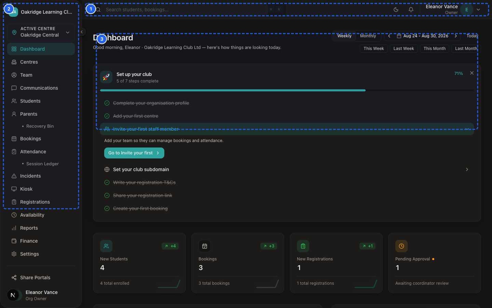
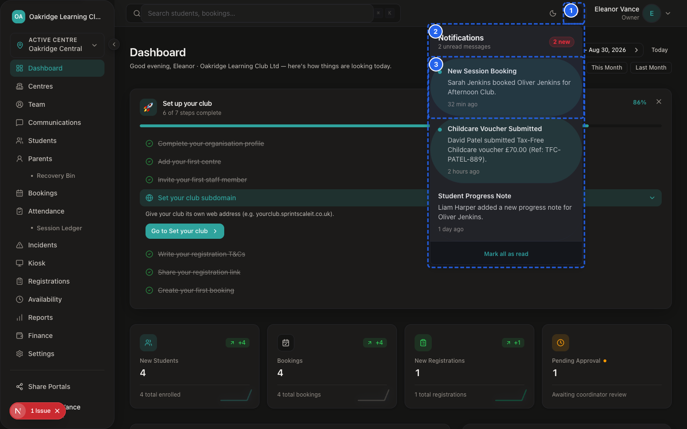
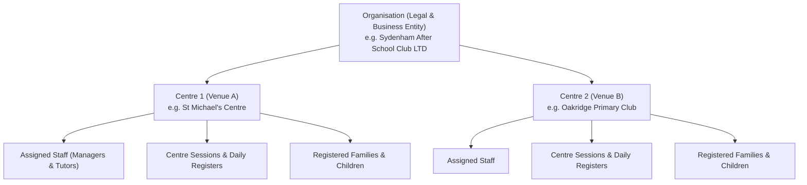
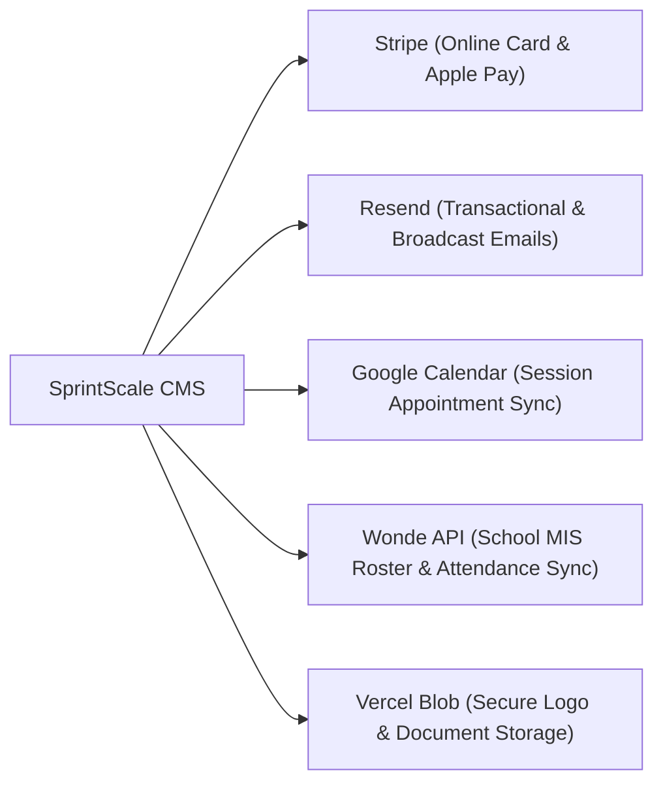

# SprintScale CMS — Master User Manual
## Part 1: System Foundations, Architecture & Security Principles

---

## 1. What SprintScale CMS Is


*Figure MM-1.1 — Global Dashboard Interface*


*Figure MM-1.2 — In-App Header Alerts Dropdown*

📹 **Video Walkthrough:** [Watch: Reviewing In-App Header Notifications](../assets/videos/SS-D6-V047.mp4)

**SprintScale CMS** is an integrated management platform purpose-built for after-school clubs, holiday activity camps, breakfast clubs, and multi-centre childcare organisations.

It unifies:
- **Child Intake & Registrations:** Public digital registration forms with medical records, emergency contacts, and digital signatures.
- **Session Bookings & Scheduling:** Public and internal booking wizards with real-time slot capacity management.
- **Classroom Attendance & Roll Call:** Fast tablet check-in/out kiosk mode and live registers with statutory custodial timestamps.
- **Child Protection & Incident Logging:** First aid tracking, accident reports, medication logging, and confidential safeguarding files.
- **Agreed-Fee Family Billing:** Whole-family recurring monthly billing with multi-sibling coverage, automated invoice runs, and Tax-Free Childcare (TFC) reconciliation.
- **Parent Self-Service Portal:** A secure, passwordless web interface for parents to review children's profiles, book upcoming sessions, and settle invoices online.

---

## 2. Who SprintScale CMS Is Designed For

SprintScale CMS is tailored for four primary user groups:

1. **Club Organisation Owners:** Business founders, directors, and head administrators overseeing multi-branch club networks, staff permissions, compliance, and overall financial health.
2. **Centre Managers:** On-site operational leaders supervising daily club sessions, managing staff rosters, triaging new registrations, and acting as Designated Safeguarding Leads (DSLs).
3. **Classroom Tutors & Front-Desk Staff:** Tutors and front-of-house administrators conducting daily roll calls, managing arrivals/departures, recording student notes, and logging standard first-aid events.
4. **Parents & Guardians:** Families registering children, booking sessions, managing medical disclosures, and paying club fees.

---

## 3. Organisation & Multi-Centre Structure

SprintScale CMS is structured as a multi-tenant hierarchy designed to reflect how real-world childcare businesses operate across multiple venues.



### Organisation vs. Centre

| Level | Scope | Managed Records & Assets |
|---|---|---|
| **Organisation** | Whole Business Network | Business registration, brand colors, club logo, bank billing rules, organisation settings, staff roles & permissions, master financial reports, Wonde school integrations. |
| **Centre** | Physical Club Location | Venue address, Ofsted registration ID, venue operating hours, daily session capacity, assigned staff members, local student registers, venue incidents. |

---

## 4. User Roles & Permission Model

SprintScale enforces strict role-based access control (RBAC) to ensure that users only see data relevant to their operational responsibilities.

```
┌─────────────────────────────────────────────────────────────┐
│                       1. OWNER                              │
│  Full access to all centres, billing, staff, and settings   │
└──────────────────────────────┬──────────────────────────────┘
                               │
┌──────────────────────────────▼──────────────────────────────┐
│                      2. MANAGER                             │
│  Supervises assigned centre(s), safeguarding, and attendance │
└──────────────────────────────┬──────────────────────────────┘
                               │
┌──────────────────────────────▼──────────────────────────────┐
│                    3. FRONT DESK                            │
│  Arrivals, registrations queue, walk-in bookings & first aid│
└──────────────────────────────┬──────────────────────────────┘
                               │
┌──────────────────────────────▼──────────────────────────────┐
│                      4. TUTOR                               │
│  Classroom roll call, tablet kiosk check-in, student flags  │
└─────────────────────────────────────────────────────────────┘
```

### Summary of System Permissions

| Module / Capability | Owner | Manager | Front Desk | Tutor |
|---|---|---|---|---|
| **Main Dashboard & Schedule** | Full (All Centres) | Assigned Centre(s) | Assigned Centre(s) | Assigned Centre(s) |
| **Daily Attendance Roll Call** | Full Access | Full Access | Full Access | Full Access |
| **Touchscreen Kiosk Mode** | Full Access | Full Access | Full Access | Full Access |
| **Log Standard Incident (Accident/Meds)** | Full Access | Full Access | Full Access | No Access |
| **Log / Read Safeguarding Files** | Full Access | Full Access | No Access | No Access |
| **Session Credit Ledger (Forgiveness)** | Full Access | Full Access | No Access | No Access |
| **View / Add / Edit Students** | Full Access | Assigned Centre(s) | Assigned Centre(s) | No Access |
| **Review Inbound Registrations** | Full Access | Assigned Centre(s) | Assigned Centre(s) | No Access |
| **Create & Reschedule Bookings** | Full Access | Assigned Centre(s) | Assigned Centre(s) | No Access |
| **Send Parent Broadcast Emails** | Full Access | Assigned Centre(s) | No Access | No Access |
| **Finance, Invoices & Bank Reconciliation**| Full Access | No Access | No Access | No Access |
| **Invite Staff & Assign Roles** | Full Access | No Access | No Access | No Access |
| **Organisation Settings & Branding** | Full Access | No Access | No Access | No Access |
| **Annual School Year Roll-Forward** | Full Access | No Access | No Access | No Access |

---

## 5. How Information Is Separated (Data Isolation)

To protect child privacy and satisfy UK GDPR requirements, SprintScale enforces multi-layer data boundaries:

1. **Organisation Isolation:** Records belonging to one organisation are strictly invisible to any other organisation.
2. **Centre-Based Scoping:** Non-owner staff members (`Manager`, `Front Desk`, `Tutor`) are explicitly assigned to specific centres in the staff directory. When logged in, they can only view students, bookings, attendance registers, and incident logs for their assigned centres.
3. **Safeguarding Quarantine:** Sensitive safeguarding records are locked behind an elevated manager-level gate. Standard front-desk staff and tutors cannot see or access safeguarding files.
4. **Parent Family Scoping:** Authenticated parents can only access records associated with their own children.

---

## 6. Authentication & Passwordless Access

### Staff Authentication
Staff access the management dashboard via `/login` using:
- **Email & Password:** Protected by encrypted password hashing (bcrypt).
- **Google Single Sign-On (OAuth):** Fast, secure login using a verified corporate Google account.
- **Staff Magic Link:** One-click email login link for staff without a configured password.

### Parent Passwordless Magic Links
Parents never have to create or remember passwords. 
1. When accessing the **Parent Portal** (`/portal/login`), the parent enters their registered email.
2. A secure, time-limited **Magic Link** is emailed to their inbox.
3. Clicking the link verifies their identity and establishes a secure 30-day session cookie (`parent_session`).

> [!NOTE]
> Magic links automatically expire after 15 minutes and can only be used once. If a link expires, the parent simply requests a fresh link from the login page.

---

## 7. Data Protection & GDPR Principles

SprintScale CMS is engineered to comply with UK Data Protection Act 2018 and UK GDPR:

- **Minimal Data Collection:** Forms collect only information necessary for child care, emergency contact, medical needs, and statutory compliance.
- **Explicit Communications Consent:** Broadcast emails are sent only to parents who have explicitly provided communications consent during registration or booking.
- **Soft Deletion & 30-Day Recovery Bin:** When a parent or student record is deleted, it is moved to the **Recovery Bin** for 30 days before permanent erasure, protecting against accidental loss of historical records.
- **Permanent GDPR Purge:** Only the Organisation Owner can perform an irreversible GDPR erasure of a parent record from the Recovery Bin.

---

## 8. Safeguarding & Child Protection Principles

> [!SAFEGUARDING]
> Child protection is the highest operational priority in SprintScale CMS.

1. **Statutory Custodial Time-Tracking:** Every roll-call check-in and check-out logs an exact timestamp and the identity of the staff member who performed the action. This creates a legally robust custodial audit trail required by Ofsted.
2. **Medical & Allergy Visibility:** Life-saving medical disclosures, severe allergies, and dietary requirements are highlighted with high-contrast alert badges on roll-call cards and student profiles.
3. **Authorised Collectors & Passwords:** Student profiles include pre-approved collection contacts and collection passwords to prevent unauthorised pickups.
4. **Confidential DSL Reporting:** Safeguarding disclosures are isolated from standard operational notes and restricted exclusively to Managers and Owners acting as Designated Safeguarding Leads.

---

## 9. Financial Control & Billing Principles

> [!FINANCIAL CONTROL]
> SprintScale CMS enforces double-entry consistency and immutable invoice numbering.

- **Agreed-Fee Whole-Family Model:** Rather than billing per session or per child, SprintScale supports a single agreed monthly fee covering all enrolled siblings at a centre.
- **Idempotent Billing Runs:** The billing engine locks each monthly cycle. Running invoice generation multiple times will never create duplicate invoices for the same period.
- **Session Credit Ledger (Attendance Reconciliation):** If a child misses an excused session, managers grant a **Forgiveness Credit** in the Session Ledger. This adjusts the child's session balance without corrupting issued invoice accounting records.
- **Offline Payment Reconciliation:** Cash, bank transfers, and Tax-Free Childcare (TFC) voucher remittances are logged with transaction reference codes and marked verified in the reconciliation hub.

---

## 10. External Integrations Overview

SprintScale seamlessly connects with industry-standard third-party providers:



- **Stripe:** Secure parent online payments with 3D Secure verification.
- **Resend:** Transactional email delivery (booking confirmations, magic links, invoices).
- **Google Calendar:** Two-way synchronization of appointment bookings into club calendars.
- **Wonde API:** Automated synchronization of student demographics and attendance data with school management systems.
- **Vercel Blob:** Secure cloud storage for organisation logos and uploaded document attachments.

---

## 11. System Health & Observability

SprintScale CMS operates on enterprise-grade serverless infrastructure:
- **Neon Serverless PostgreSQL:** Managed relational database with continuous point-in-time backups.
- **Upstash Redis:** Distributed rate-limiting protecting public forms from automated spam or brute-force attacks.
- **Sentry Error Tracking:** Real-time exception capture and error alerting.
- **Uptime Monitoring:** Continuous health check probes verifying uptime at `/api/health`.

---

## 12. Operational Do's and Don'ts

### What Users SHOULD Do:
- [x] Check in children immediately upon arrival to maintain real-time headcount accuracy.
- [x] Log any minor injury or first-aid treatment before the child departs for the day.
- [x] Review new registrations daily to ensure timely parent communication.
- [x] Record Tax-Free Childcare voucher reference codes when reconciling bank remittances.

### What Users MUST NOT Do:
- [ ] **Do NOT log safeguarding disclosures as standard incidents.** Use the dedicated Safeguarding category.
- [ ] **Do NOT edit issued or paid invoices to handle missed sessions.** Use the Session Credit Ledger.
- [ ] **Do NOT share staff login credentials.** Every staff member must have their own named account.
- [ ] **Do NOT send mass marketing broadcasts to parents who have not consented to communications.**

---

## 13. Getting Help & Support

If you encounter an issue:
1. **Check the Role Guide:** Refer to your specific role guide for procedural guidance.
2. **Consult the Troubleshooting Guide:** Search the error handbook in the documentation library.
3. **Contact Your Organisation Owner / Manager:** For account permissions, centre assignments, or policy questions.
4. **Technical Escalation:** Organisation Owners can escalate infrastructure issues to SprintScale support.
