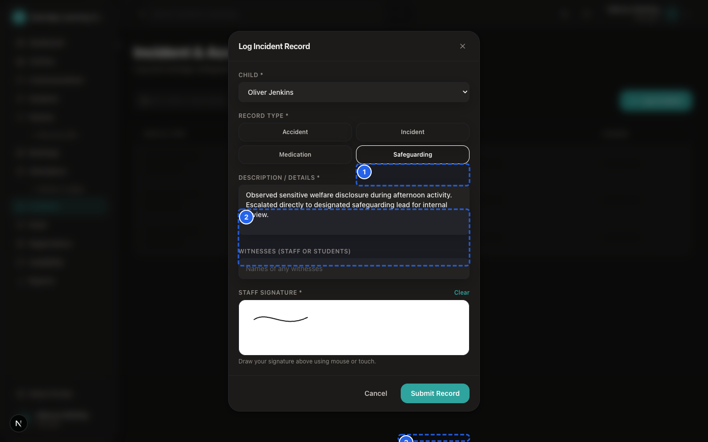

# SprintScale CMS — Master User Manual
## Part 3: The Daily Attendance, Classroom Delivery & Incident Journey

---

## 1. Overview of the Daily Session Journey

This master journey maps the operational lifecycle of a student during a live club session — from arrival through classroom roll call, operational flags, departure pickups, first aid handling, and internal safeguarding logging.

```
┌─────────────────────────────────────────────────────────────┐
│                 STAGE 1: SCHEDULED BOOKING                  │
│  Child appears on today's session register & tablet kiosk   │
└──────────────────────────────┬──────────────────────────────┘
                               │
┌──────────────────────────────▼──────────────────────────────┐
│                 STAGE 2: ARRIVAL & CHECK-IN                 │
│  Tutor/Front Desk taps "Check In" (Arrival timestamp set)   │
│  System checks for late minutes & displays medical badges   │
└──────────────────────────────┬──────────────────────────────┘
                               │
┌──────────────────────────────▼──────────────────────────────┐
│                 STAGE 3: CLASSROOM ENGAGEMENT               │
│  Tutor toggles Homework & Behaviour flags on roll call card │
│  Staff record educational progress notes & draft scorecards │
└──────────────────────────────┬──────────────────────────────┘
                               │
               ┌───────────────┴───────────────┐
               ▼                               ▼
    [MINOR FIRST AID EVENT]         [SAFEGUARDING CONCERN]
   Staff applies first aid;         Tutor reports concern in person
   Front Desk logs Accident with    to appointed Manager; Manager
   treatment & signature.           logs in restricted `/incidents`.
               │                               │
               └───────────────┬───────────────┘
                               │
┌──────────────────────────────▼──────────────────────────────┐
│                 STAGE 4: PICKUP & CHECK-OUT                 │
│  Staff verifies Authorised Collector name & password        │
│  Taps "Check Out" (Departure timestamp recorded)            │
└─────────────────────────────────────────────────────────────┘
```

---

## 2. Stage 1: Register Roster Preparation

Before children arrive:
- Confirmed bookings for the day automatically populate the **Attendance Register** (`/dashboard/attendance`) and the **Tablet Kiosk** (`/dashboard/kiosk`).
- Staff review the expected headcount to ensure adequate staffing.
- **Medical Alert Badges** (Red = Severe Allergy/Condition, Yellow = Dietary, Blue = SEN) are reviewed during session preparation.

---

## 3. Stage 2: Physical Arrival & Check-In


*Figure MM-3.1 — Daily Attendance Register*

📹 **Video Walkthrough:** [Watch: Marking Morning and Afternoon Class Register](../assets/videos/SS-D6-V006.mp4)

When the child enters the club premises:
1. Staff locate the child's card on the register or tap the card on the touchscreen Kiosk.
2. Tap **Check In**.
3. **What the CMS Records:**
   - Exact `checkInAt` ISO timestamp.
   - If the arrival is after the scheduled start time, the system derives `lateMinutes` automatically.
   - Staff member's user ID is logged as `attendanceMarkedBy`.

---

## 4. Stage 3: Classroom Engagement, Notes & Flags

During the session:
- **Homework & Behaviour:** Tutors tap the flag icons on the attendance register to record completed homework or positive conduct.
- **Progress Scorecards:** For academic tutoring clubs, tutors record scores and draft constructive progress feedback for parent review.
- **Absence Tally:** Children who did not attend are marked with an **Absence Reason** (`Illness`, `Holiday`, `Family`, `Other`), which automatically feeds into the **Session Credit Ledger**.

---

## 5. Stage 4: Incident Handling vs. Safeguarding Escalation

SprintScale separates health and safety events into two distinct recording pathways:

### Pathway A: Standard First Aid & Minor Accidents


*Figure MM-3.2 — First Aid Accident Logging & Body Map*

📹 **Video Walkthrough:** [Watch: Logging a First Aid Accident on Body Map](../assets/videos/SS-D6-V011.mp4)
- **Examples:** Playground tumble, skinned knee, ice pack application, scheduled asthma inhaler administration.
- **Workflow:** Staff administer first aid immediately, then open `Sidebar → Incidents → + Log Incident` and record the treatment, witnesses, and staff signature under `Accident` or `Medication`.
- **Visibility:** Visible in CMS to Front Desk, Managers, and Owners.

### Pathway B: Restricted Child Safeguarding Concerns


*Figure MM-3.3 — Confidential Safeguarding Incident Form*

📹 **Video Walkthrough:** [Watch: Creating a Confidential Safeguarding Record](../assets/videos/SS-D6-V012.mp4)
- **Examples:** Physical injury marks, signs of abuse/neglect, explicit verbal disclosures.
- **Workflow:** Staff follow their organisation's safeguarding policy; **record zero notes in general student files**; report verbally in private to their centre's appointed safeguarding lead or manager.
- **CMS Recording:** An authorised Manager or Owner logs the formal report in `Sidebar → Incidents` under the `Safeguarding` type.
- **Visibility:** Restricted in CMS to Manager and Owner accounts.

---

## 6. Stage 5: Verified Pickup & Check-Out

At the end of the session:
1. The collecting adult arrives at the reception desk.
2. Front-desk staff or tutors check the student profile's **Authorised Collectors** list.
3. If the collecting adult is unfamiliar, staff ask for the **Collection Password**.
4. Once verified, staff tap **Check Out** on the register or Kiosk.
5. The `checkOutAt` departure timestamp is recorded, completing the daily attendance record.
