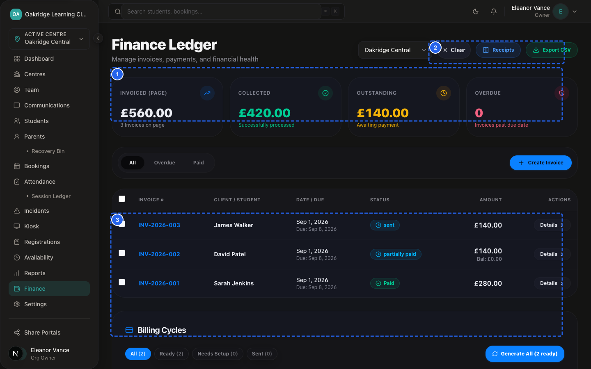
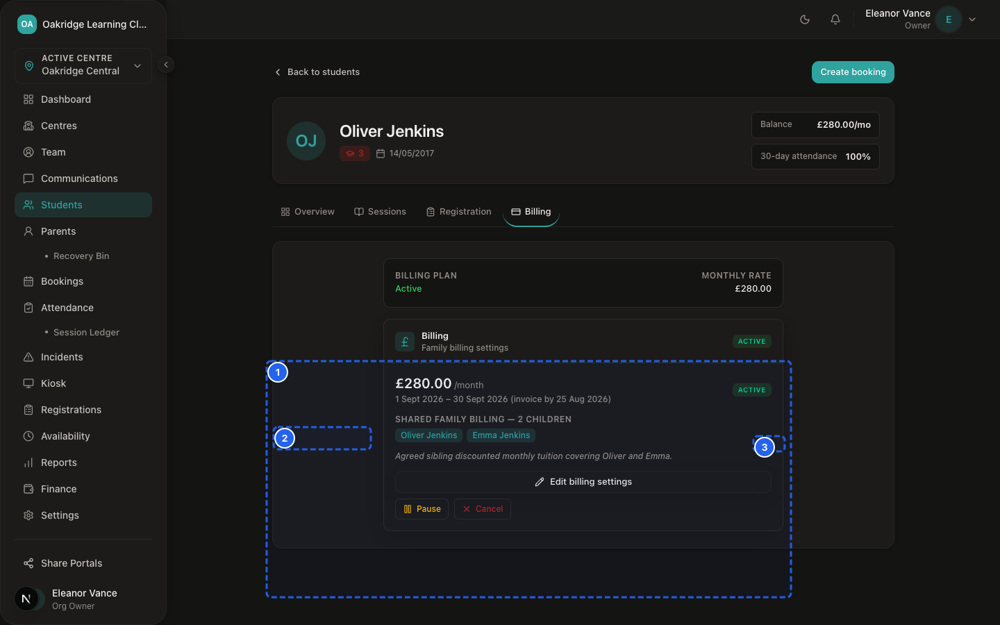
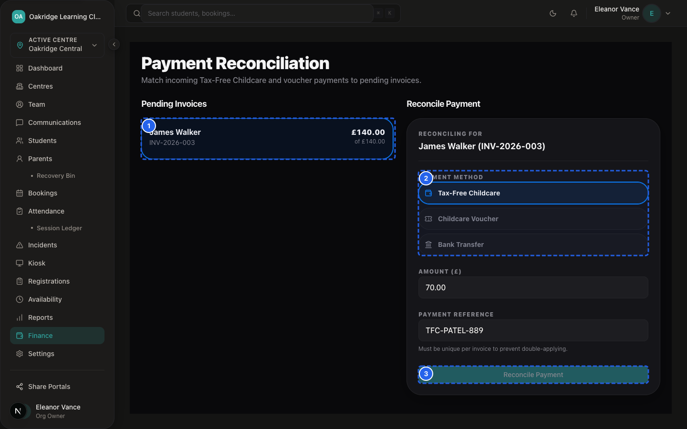

# SprintScale CMS — Master User Manual
## Part 4: The End-to-End Finance, Agreed-Fee Billing & Payment Journey

---

## 1. Overview of the Complete Financial Journey


*Figure MM-4.1 — Executive Finance Dashboard*

This master journey maps the commercial and billing lifecycle of a family within SprintScale CMS — from initial fee configuration through monthly invoice generation, parent notification, multi-channel payment collection, voucher reconciliation, and receipt delivery.

```
┌─────────────────────────────────────────────────────────────┐
│               STAGE 1: AGREED FEE SETUP                     │
│  Staff configure monthly family tuition & anchor dates      │
└──────────────────────────────┬──────────────────────────────┘
                               │
┌──────────────────────────────▼──────────────────────────────┐
│            STAGE 2: MONTHLY INVOICE GENERATION              │
│  Automated cron / manual run generates draft invoices       │
│  Application pre-check in `billingRuns` prevents duplicates │
└──────────────────────────────┬──────────────────────────────┘
                               │
┌──────────────────────────────▼──────────────────────────────┐
│          STAGE 3: PARENT NOTIFICATION & PORTAL              │
│  Parent receives invoice email & views balance on `/portal` │
└──────────────────────────────┬──────────────────────────────┘
                               │
               ┌───────────────┴───────────────┐
               ▼                               ▼
    [OFFLINE PAYMENT CHANNELS]      [VOUCHER / TFC CLAIMS]
   Staff log Cash / Bank Transfer   Parent submits HMRC/Voucher code;
   in `/dashboard/finance/invoices`.Appears in Reconciliation queue.
               │                               │
               │                    [STAFF RECONCILIATION]
               │                    Staff verify bank cleared funds;
               │                    Click "Verify" on `/reconciliation`.
               │                               │
               └───────────────┬───────────────┘
                               │
┌──────────────────────────────▼──────────────────────────────┐
│            STAGE 4: BALANCE SETTLEMENT & RECEIPTS           │
│  Invoice marks "PAID"; parent receives confirmation receipt │
│  Audit events logged & revenue reflected in dashboard KPIs  │
└─────────────────────────────────────────────────────────────┘
```

---

## 2. Stage 1: Family Agreed-Fee Setup


*Figure MM-4.2 — Family Agreed-Fee Billing Config*

📹 **Video Walkthrough:** [Watch: Setting up Agreed Monthly Family Tuition Fee](../assets/videos/SS-D6-V013.mp4)

When a new family registers or enrolls:
1. Staff navigate to the student profile or parent record.
2. Under **Family Billing**, staff configure the **Agreed Monthly Fee** (e.g. £250.00) and link all enrolled siblings.
3. Staff set the **Billing Anchor Date** (e.g. 1st of every month) and **Invoice Lead Days** (e.g. 7 days).
4. The agreement is saved in `active` status.

---

## 3. Stage 2: Invoice Generation & Duplicate Prevention


*Figure MM-4.3 — Monthly Invoicing Batch Run Preview*

📹 **Video Walkthrough:** [Watch: Executing Monthly Invoicing Batch Run](../assets/videos/SS-D6-V014.mp4)

As the billing anchor date approaches:
1. **Automated Daily Run:** The daily billing cron job evaluates active configs. When the current date reaches `anchorDate - leadDays`, the invoice is generated automatically.
2. **Duplicate Run Protection:** The system records an entry in the `billingRuns` table. An application pre-check prevents generating duplicate invoices for the same period.
3. **Line-Item Generation:** The invoice is generated in `draft` status, stamped with an invoice number (`INV-XXXXXX`), and populates `coveredChildrenJson` with all linked siblings.

---

## 4. Stage 3: Parent Review & Notification

Once generated:
1. An automated email is sent to the parent containing the invoice summary, amount, due date, and a direct link to `/portal/billing`.
2. The parent logs into the Parent Portal via passwordless magic link.
3. The parent views the total outstanding balance and the breakdown of invoices due.

---

## 5. Stage 4: Multi-Channel Payment & Reconciliation


*Figure MM-4.4 — Childcare Voucher & TFC Reconciliation Queue*

📹 **Video Walkthrough:** [Watch: Reconciling Childcare Vouchers & TFC](../assets/videos/SS-D6-V017.mp4)

Parents settle their invoices through one of four primary pathways:

- **Pathway A: Direct Bank Transfer (BACS / Faster Payments):** Parent transfers funds to the club's bank account using their invoice number as reference. Staff verify receipt on bank statement and click **Record Payment** in the CMS.
- **Pathway B: Cash at Reception:** Parent pays physical cash at the front desk. Staff click **Record Payment**, select `Cash`, and enter the amount received.
- **Pathway C: Tax-Free Childcare (TFC) & Vouchers:** Parent transfers funds via their HMRC Childcare Account or voucher provider (e.g. Edenred, Care-4, Computershare), then submits their reference code in the Parent Portal. Staff review the submission on `/dashboard/finance/reconciliation` and click **Verify Payment**.
- **Pathway D: Online Card Payment (Stripe):** When enabled, parents click **Pay with Card** in the portal to settle instantly via credit/debit card.

---

## 6. Stage 5: Settlement, Receipts & Financial Reporting

When verified payments equal or exceed the total invoice amount:
1. Invoice status transitions automatically from `draft`/`partially_paid` to **`paid`**.
2. A payment receipt email is dispatched to the parent.
3. The invoice details page updates the remaining balance to **£0.00**.
4. Both staff and parents can download PDF copies of the invoice and downloadable payment record receipt at any time.
5. Revenue is aggregated into the Owner's financial dashboard overview metrics.
