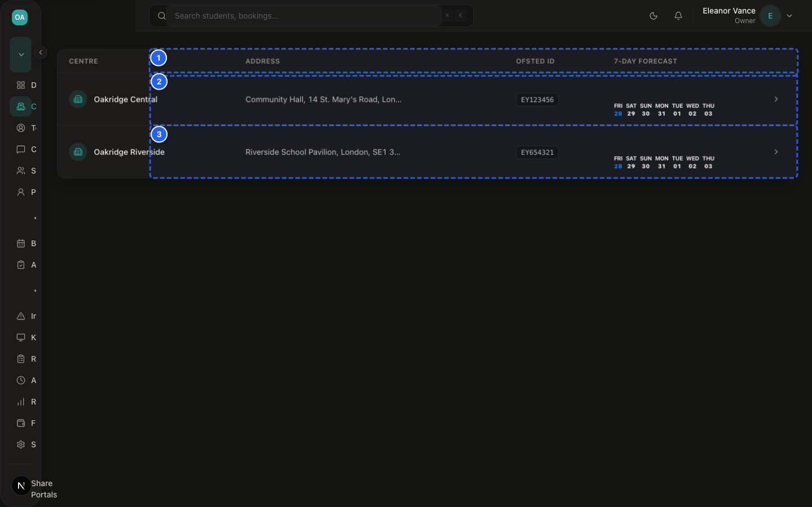
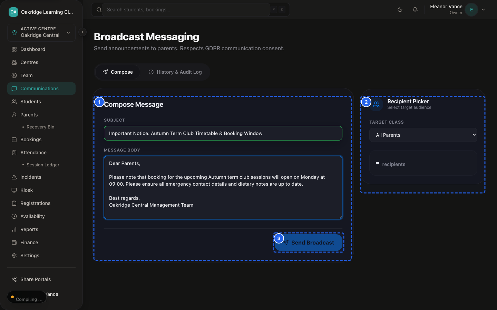
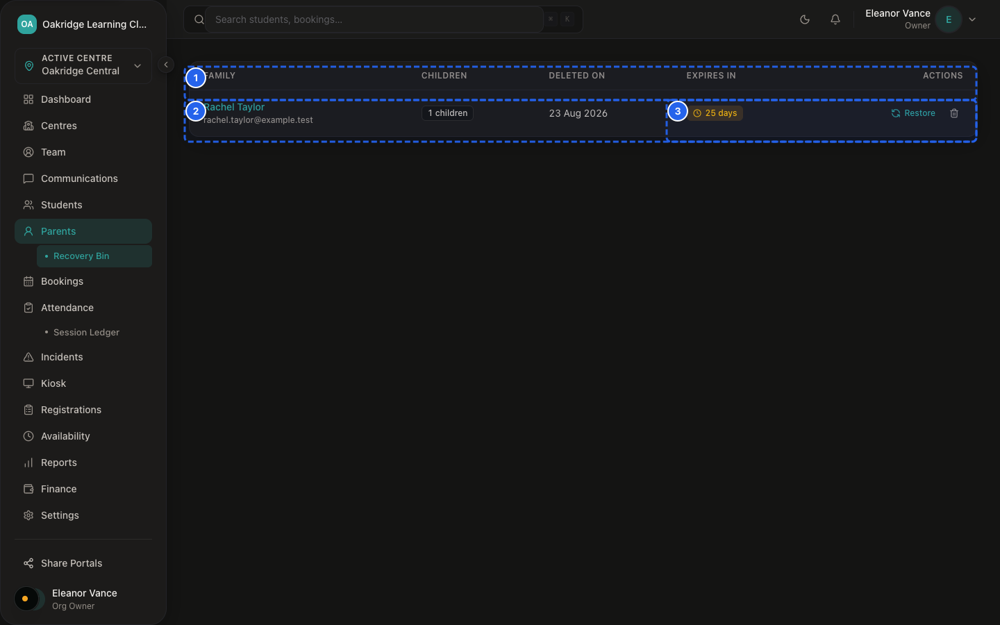

# SprintScale CMS — Master User Manual
## Part 5: Organisation Administration, Staff Access, Communications & Data Operations

---

## 1. Overview of the Administrative Architecture

SprintScale CMS provides a multi-centre administration and access-control layer designed specifically for after-school club and tuition network operators.

The administrative hierarchy flows downwards from the Organisation root to individual venues, staff members, parents, and historical data:

```
┌─────────────────────────────────────────────────────────────┐
│                      ORGANISATION ROOT                      │
│  • Primary tenant container (`organisations`)               │
│  • Organisation Owners (`ORG_OWNER`) manage global settings │
│  • Aggregates all venues, staff, and financial ledgers      │
└──────────────────────────────┬──────────────────────────────┘
                               │
               ┌───────────────┴───────────────┐
               ▼                               ▼
    [CENTRE / VENUE A]              [CENTRE / VENUE B]
   Physical club location          Physical club location
   Operating hours, Ofsted ID,     Operating hours, Ofsted ID,
   Centre-specific billing & bank  Centre-specific billing & bank
               │                               │
               ├───────────────────────────────┤
               ▼                               ▼
    [STAFF DIRECTORY & ROLES]       [CENTRE ASSIGNMENTS]
   Users invited via email token   Scoping Manager/Front Desk/
   Roles: OWNER, MGR, FRONT, TUTOR  Tutor access to assigned sites
               │                               │
               └───────────────┬───────────────┘
                               │
┌──────────────────────────────▼──────────────────────────────┐
│           COMMUNICATIONS, ROLLOVER & DATA CONTROLS          │
│  • Parent Broadcasts: Scoped by centre & consent filter     │
│  • Academic-Year Rollover: Automated Sept 1st progression   │
│  • Data Maintenance: Soft-deletion & 30-day Recovery Bin    │
│  • Audit Logging: Structured event trails for critical acts │
└─────────────────────────────────────────────────────────────┘
```

---

## 2. Organisation vs. Centre: Core Boundary


*Figure MM-5.1 — Multi-Centre Venue Directory*

📹 **Video Walkthrough:** [Watch: Creating & Setting Up a New Centre Venue](../assets/videos/SS-D6-V020.mp4)

SprintScale makes a strict distinction between an **Organisation** and a **Centre**:

| Dimension | Organisation (`organisations`) | Centre (`centres`) |
|---|---|---|
| **What It Represents** | The legal business entity or tuition company. | A physical club premises, school hall, or tuition site. |
| **Top-Level Role** | Organisation Owner (`ORG_OWNER`). | Centre Manager (`MANAGER`). |
| **Scope of Data** | Cross-centre overview: all pupils, staff, revenue, and audits. | Site-scoped: pupils, attendance, sessions, and parent intake for that venue. |
| **Financial Settings** | Global currency, tax registration, and billing defaults. | Specific bank sort code, account number, and local pricing. |
| **Staffing** | Central staff directory and organisation-wide invitations. | Individual staff member assignments (`centreMemberships`). |

---

## 3. The 4 Staff Roles & Server-Side Permission Boundaries


*Figure MM-5.2 — Staff Directory Roster*

📹 **Video Walkthrough:** [Watch: Scoping Staff Access Across Specific Centres](../assets/videos/SS-D6-V024.mp4)

SprintScale implements a four-tier Role-Based Access Control (RBAC) model:

```
┌─────────────────────────────────────────────────────────────┐
│                    FOUR CMS STAFF ROLES                     │
├─────────────────────────────────────────────────────────────┤
│  1. `ORG_OWNER`: Complete organisation-wide authority.      │
│     Can invite staff, change roles, void invoices, manage   │
│     centre billing, and perform GDPR data exports.          │
│                                                             │
│  2. `MANAGER`: Operational centre supervisor.               │
│     Full operational authority over assigned centres. Can   │
│     create centres, manage intake, roll call, session logs, │
│     safeguarding records, and send parent broadcasts.       │
│                                                             │
│  3. `FRONT_DESK`: Daily reception administrator.            │
│     Can check in students, view profiles, create walk-in    │
│     bookings, and record offline cash/bank payments.        │
│     Blocked from safeguarding records, voiding, and admin.  │
│                                                             │
│  4. `TUTOR`: Activity leader & classroom teacher.           │
│     Scoped strictly to live roll call, student notes, and   │
│     progress scorecards. Zero access to finance, admin, or  │
│     parent account records.                                 │
└─────────────────────────────────────────────────────────────┘
```

> [!IMPORTANT]
> **Preserving the Safeguarding Role Distinction:**
> Having the `MANAGER` or `ORG_OWNER` software role in SprintScale grants access to restricted incident and safeguarding record screens in the database. However, **CMS permissions do not itself appoint an individual as a formal Designated Safeguarding Lead (DSL)**. Formal DSL appointments and statutory local authority referral duties are determined by club organisation policy.

---

## 4. End-to-End Staff Invitation & Onboarding Lifecycle

```
┌─────────────────────────────────────────────────────────────┐
│               STAGE 1: OWNER DISPATCHES INVITE              │
│  Owner enters email, name, role, and optional initial centre│
│  at `/dashboard/staff/invite`.                              │
└──────────────────────────────┬──────────────────────────────┘
                               │
┌──────────────────────────────▼──────────────────────────────┐
│            STAGE 2: CRYPTOGRAPHIC TOKEN GENERATED           │
│  System generates 32-byte raw token, stores SHA-256 hash in │
│  `staffInvites`, and dispatches email via Resend with link. │
└──────────────────────────────┬──────────────────────────────┘
                               │
┌──────────────────────────────▼──────────────────────────────┐
│            STAGE 3: RECIPIENT ACCEPTS INVITATION            │
│  Staff clicks link `/accept-invite?token=...`, account is   │
│  created/linked, and user signs in via Magic Link.          │
└──────────────────────────────┬──────────────────────────────┘
                               │
┌──────────────────────────────▼──────────────────────────────┐
│            STAGE 4: ACCESS SCOPING & MAINTENANCE            │
│  Owner assigns additional centres on staff profile. Access  │
│  can be modified, paused, or detached at any time.          │
└─────────────────────────────────────────────────────────────┘
```

---

## 5. Communications, Consent & Broadcasts


*Figure MM-5.3 — Parent Email Broadcast Composer*

📹 **Video Walkthrough:** [Watch: Broadcasting an Email to Consented Parents](../assets/videos/SS-D6-V027.mp4)

SprintScale allows Owners and Managers to communicate with parents at scale:

- **Targeted Broadcasts:** Comms can be scoped to all centres or filtered to a single assigned venue.
- **Server-Side Consent Filtering:** When initiating a broadcast, the system automatically evaluates the parent's latest booking preference. Only parents whose current stated preference is opted-in receive broadcast emails.
- **Transactional vs. Operational:** Essential transactional notices (e.g. invoice notifications, booking confirmations, emergency incident reports) are dispatched directly to the parent's registered email address without promotional consent checks.

---

## 6. Academic-Year Rollover & Data Retention


*Figure MM-5.4 — Recovery Bin Soft-Deleted Records Roster*

📹 **Video Walkthrough:** [Watch: Irreversible Permanent GDPR Family Purge](../assets/videos/SS-D6-V030.mp4)

- **Automated September 1st Rollover:** SprintScale includes an automated cron service (`/api/cron/school-year-roll`) that advances pupil year groups by one grade annually on September 1st (e.g. Nursery $\to$ Reception $\to$ Year 1 $\to \dots \to$ Year 13 $\to$ Graduated). The endpoint uses PostgreSQL transactional advisory locking and completion audit checks to guarantee single-execution idempotency.
- **Soft-Deletion & Recovery Bin:** Deleting a family moves the parent and linked child records to the **Recovery Bin** (`/dashboard/parents/bin`) with a `deletedAt` timestamp. Staff have 30 days to restore the record before background purging, and permanent on-demand erasure is restricted strictly to Organisation Owners.
- **Audit Event Trail:** High-risk actions (invoice creation, payment logging, invoice voiding, and annual rollover completion) emit structured audit events in `auditEvents` with actor attribution, timestamp, and metadata.
