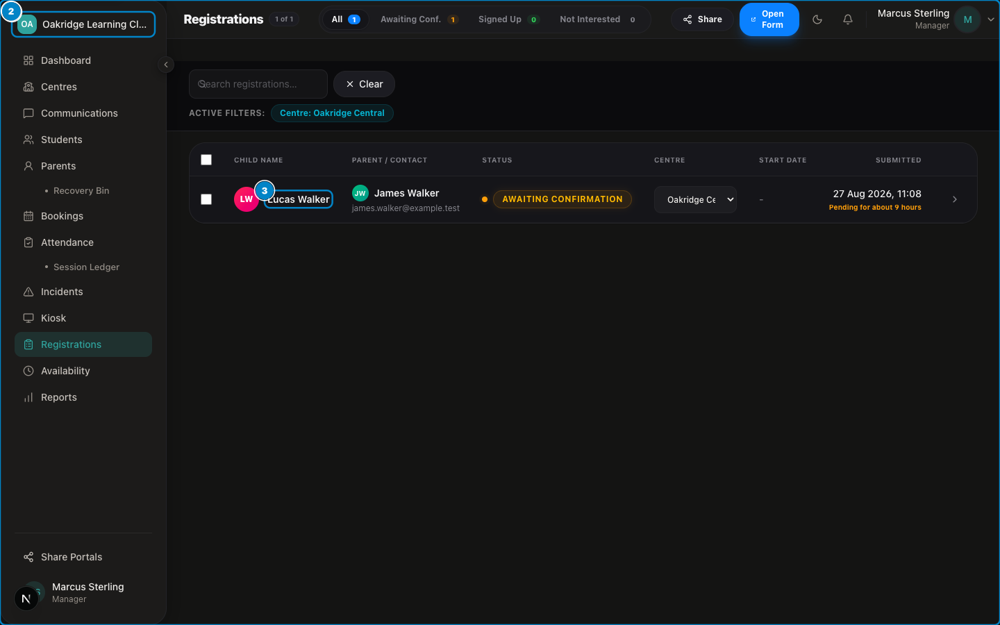

# SprintScale CMS — Quick Start Guide
## Centre Manager: The First 30 Minutes

**Target Audience:** New Centre Managers  
**Estimated Time:** 30 Minutes  
**Goal:** Activate your staff account, verify your assigned centre access, review student rosters, and prepare for live session supervision.

---

## 30-Minute Manager Readiness Checklist

```
  [00:00 - 05:00]  Step 1: Activate account via email invite and set secure password
  [05:00 - 10:00]  Step 2: Sign in and verify your assigned centre scope
  [10:00 - 15:00]  Step 3: Review student directory and critical medical/allergy alerts
  [15:00 - 20:00]  Step 4: Triage inbound registrations queue and confirm new signups
  [20:00 - 25:00]  Step 5: Verify today's attendance roll call and session schedule
  [25:00 - 30:00]  Step 6: Confirm Designated Safeguarding Lead (DSL) incident logging access
```

---

### Step 1: Activate Account via Email Invite (Minutes 0–5)
1. Open the invitation email sent from SprintScale on behalf of your Organisation Owner.
2. Click the secure **Activate Account** link.
3. You will be directed to `/accept-invite`.
4. Enter your full name and choose a strong, unique password.
5. Click **Activate & Sign In**.

---

### Step 2: Verify Assigned Centre Access (Minutes 5–10)
1. You will arrive at the main Dashboard (`/dashboard`).
2. Look at the top bar centre selector dropdown.
3. Verify that your assigned club centre(s) appear in the list.
4. If your centre name does not appear, contact your Organisation Owner to verify your centre membership assignment.

---

### Step 3: Review Student Directory & Medical Alerts (Minutes 10–15)
1. Navigate to: `Sidebar → Students`.
2. Browse your enrolled students list.
3. Notice any student cards with **Red Alert Badges** (indicating severe allergies, asthma, dietary requirements, or SEN details).
4. Click on a student to inspect their full profile, emergency phone numbers, and authorised pickup contacts.

---

### Step 4: Triage Inbound Registrations Queue (Minutes 15–20)


*Figure QS-M.1 — Inbound Registration Intake Triage*

📹 **Video Walkthrough:** [Watch: Reviewing & Approving a Public Registration](../assets/videos/SS-D6-V002.mp4)
1. Navigate to: `Sidebar → Registrations`.
2. Review any submitted applications with status **Awaiting Confirmation**.
3. Open a submission to check the parent's contact info, emergency contacts, and digital signature.
4. Click **Confirm & Sign Up** to convert the applicant into an active student.

---

### Step 5: Verify Attendance Register & Today's Schedule (Minutes 20–25)


*Figure QS-M.2 — Daily Attendance Register*

📹 **Video Walkthrough:** [Watch: Marking Morning and Afternoon Class Register](../assets/videos/SS-D6-V006.mp4)
1. Navigate to: `Sidebar → Attendance`.
2. Verify today's expected session headcount and student roster.
3. Practice locating the **Check In**, **Late**, and **Absent** buttons.
4. Note the **Session Ledger** link in the sub-menu for tracking absence arrears.

---

### Step 6: Confirm Safeguarding & Incident Access (Minutes 25–30)
1. Navigate to: `Sidebar → Incidents`.
2. Click **+ Log Incident**.
3. Verify that the **Safeguarding** option is visible in your incident type dropdown (confirming your manager-level Designated Safeguarding Lead access).
4. Cancel out of the modal without saving synthetic data.

---

## Expected Outcome After 30 Minutes

✅ Your manager account is active and secured.  
✅ Your centre scope is verified and locked to your physical location.  
✅ You know where to view critical medical flags and emergency numbers.  
✅ You are ready to supervise classroom roll calls and manage safeguarding files.

---

## Next Steps & Comprehensive Documentation
- [Centre Manager Role Guide](../role-guides/manager-guide.md) — Day-to-day operations, attendance, and Designated Safeguarding Lead workflows.
- [Registrations & Intake Manual](../functional-manuals/registrations.md) — Reviewing, approving, and triaging inbound student applications.
- [Daily Attendance Register Manual](../functional-manuals/attendance.md) — Live roll calls, time-tracking, and absence credit reconciliation.
