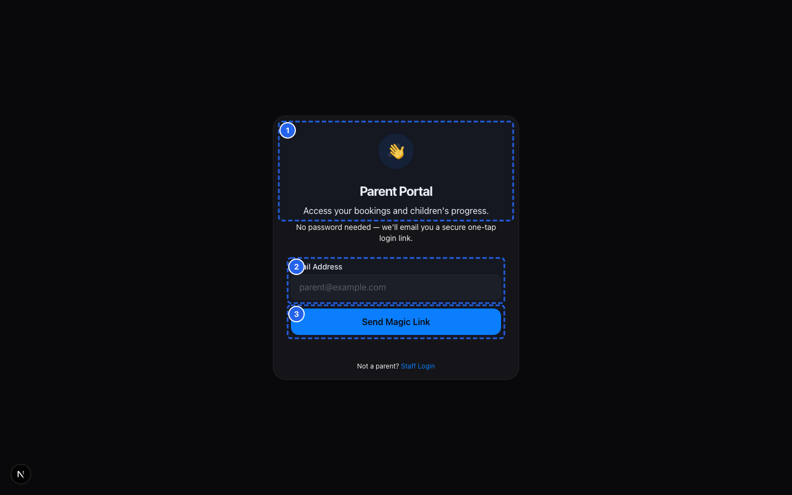
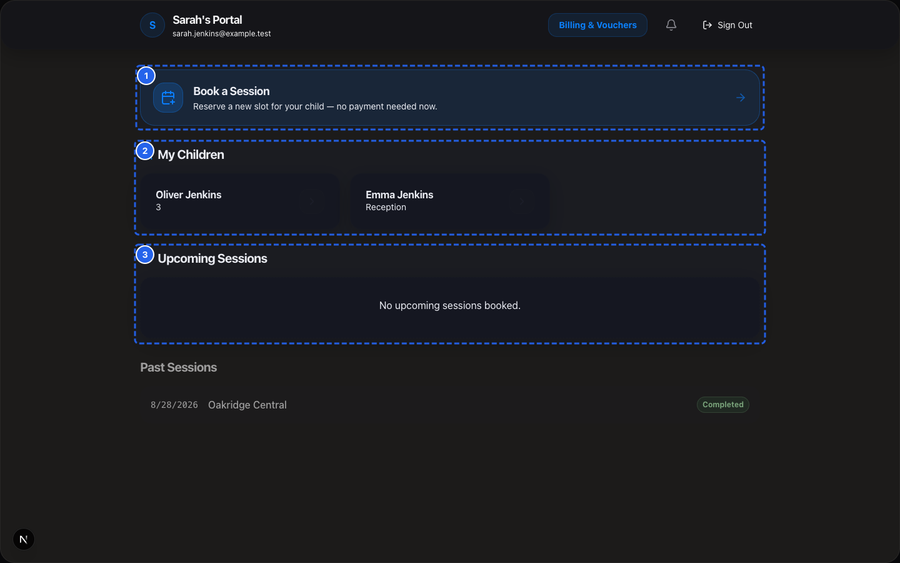

# SprintScale CMS — Quick Start Guide
## Parents: Getting Started with Your Parent Portal

**Target Audience:** Parents and Guardians  
**Estimated Time:** 5 Minutes  
**Goal:** Access your secure online account, check your children's details, book sessions, and settle club fees.

---

## 4 Easy Steps to Get Started

```
  [Step 1]  Open the sign-in page (`/portal/login`)
  [Step 2]  Enter your email to receive your secure Magic Link
  [Step 3]  Tap the link in your email inbox to log in
  [Step 4]  View your children, book upcoming sessions, or pay bills
```

---

### Step 1: Request Your Secure Sign-In Link


*Figure QS-P.1 — Passwordless Sign-In Link Request*


*Figure QS-P.2 — Parent Portal Home View*

📹 **Video Walkthrough:** [Watch: Parent Magic Link Sign-In & Portal Tour](../assets/videos/SS-D6-V031.mp4)
1. On your smartphone or computer, open your web browser and go to:  
   👉 **`https://app.sprintscaleit.co.uk/portal/login`**
2. Type in the **Email Address** you provided when registering your child.
3. Tap **Send Magic Link**.

---

### Step 2: Open the Link in Your Inbox
1. Open your email inbox (e.g. Gmail, Outlook, Apple Mail).
2. Look for an email from your club with the subject **"Sign in to your Parent Portal"**.
3. Tap the button or link inside the email: **Sign In to Parent Portal**.
4. You will be automatically logged in to your account. No password is required!

> [!TIP]
> **Link expired?** Magic links expire after 15 minutes for your security. If you see an "Expired Link" message, simply visit `/portal/login` again and request a fresh link.

---

### Step 3: Check Your Children's Information
1. On your portal home screen, you will see your registered children.
2. Tap a child's name to view their profile.
3. Check that medical conditions, allergies, dietary needs, and emergency phone numbers are correct.
4. If anything has changed, tap **Edit Medical Notes** and save your updates.

---

### Step 4: Book Sessions or Pay Invoices

📹 **Video Walkthrough:** [Watch: Booking a Session via Parent Portal](../assets/videos/SS-D6-V005.mp4)
- **To Book a Session:** Tap **Book Sessions** at the top of your screen, choose your dates, and tap **Confirm**.
- **To Pay a Bill:** Tap **Billing**, locate any unpaid invoice, and tap **Pay with Card / Apple Pay** to settle securely online.
- **To Pay via Tax-Free Childcare:** Make the payment in your Government Childcare Account, then enter your reference code under the invoice in your portal.

---

## Need Help?
If you have any questions about your bookings, session fees, or registration details, please reach out directly to your club centre manager or call the centre desk.

---

## Comprehensive Documentation & Support
- [Parent & Carer Role Guide](../role-guides/parent-guide.md) — Comprehensive guide to parent portal features, magic links, and billing.
- [Family & Parent Account Manual](../functional-manuals/parents.md) — Profile management, emergency contacts, and privacy controls.
