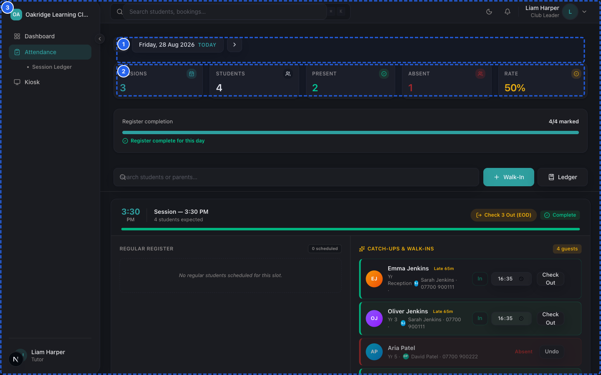
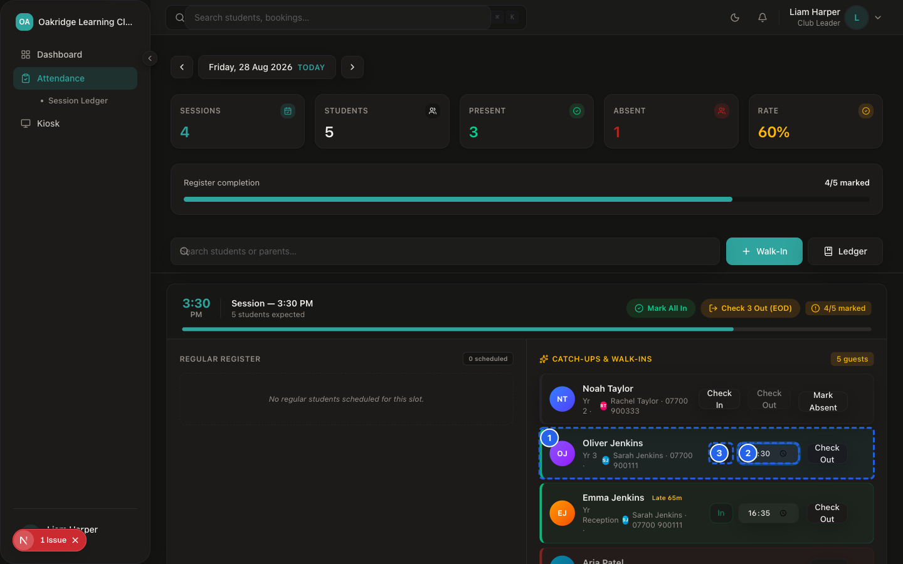
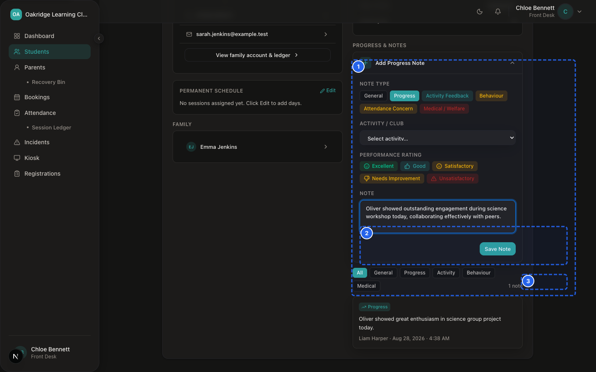
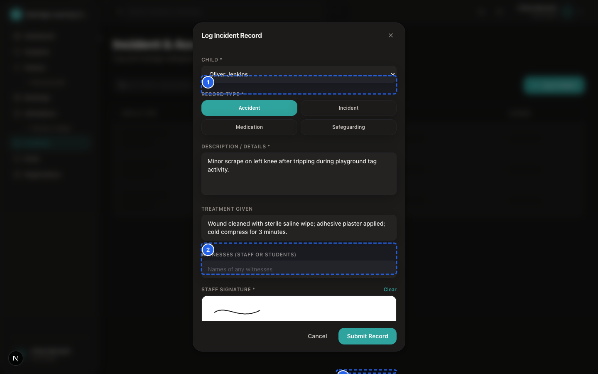

# SprintScale CMS — Role Guide: Tutor
## Classroom Delivery, Roll Call & Student Engagement Manual

---

## 1. Tutor Role Overview

As a **Tutor** (classroom club leader), you are the primary face of the club during daily sessions. You manage classroom activities, take statutory attendance roll calls, monitor student medical flags, and support student progress.

### Key Responsibilities
- **Live Classroom Roll Call:** Checking in students, recording exact arrival and departure times, and noting absences.
- **Child Welfare & Medical Awareness:** Reviewing allergy badges, dietary restrictions, and special needs flags on roll-call cards.
- **Operational Student Flags:** Setting real-time homework and behaviour flags on student attendance cards.
- **Assessment & Progress Feedback:** Completing student assessment scorecards and drafting progress feedback for parents.
- **Safeguarding Vigilance:** Identifying child protection concerns and immediately escalating them to the Centre Manager (Designated Safeguarding Lead).

---

## 2. Daily Tutor Operational Workflow

```
┌─────────────────────────────────────────────────────────────┐
│                    1. ARRIVAL & BRIEFING                    │
│  • Log into `/dashboard` on tablet or classroom computer   │
│  • Select your Centre if prompted                           │
│  • Review today's session schedule and expected headcount   │
│  • Note any highlighted medical/allergy badges              │
└──────────────────────────────┬──────────────────────────────┘
                               │
┌──────────────────────────────▼──────────────────────────────┐
│                    2. ACTIVE ROLL CALL                      │
│  • Open `/dashboard/attendance` (or `/dashboard/kiosk`)     │
│  • Tap "Check In" as each child enters the room             │
│  • Mark "Absent" with reason if a child fails to arrive     │
└──────────────────────────────┬──────────────────────────────┘
                               │
┌──────────────────────────────▼──────────────────────────────┐
│                    3. DURING THE SESSION                    │
│  • Update homework / behaviour flags on student cards       │
│  • Draft assessment feedback notes if conducting reviews    │
│  • Report any minor injuries immediately to Front Desk/DSL  │
└──────────────────────────────┬──────────────────────────────┘
                               │
┌──────────────────────────────▼──────────────────────────────┐
│                    4. SESSION DEPARTURE                     │
│  • Tap "Check Out" as each child is collected by parent     │
│  • Confirm 100% of children are checked out before closing  │
└─────────────────────────────────────────────────────────────┘
```

---

## 3. What Tutors Can and Cannot Access

### What You CAN Access:
- **Dashboard:** View today's club schedule, session times, and expected attendee counts.
- **Attendance Register (`/dashboard/attendance`):** Perform live check-ins, check-outs, mark present/late/absent, and set homework/behaviour flags.
- **Kiosk Mode (`/dashboard/kiosk`):** Fullscreen tablet interface for rapid one-touch student check-in/out.
- **Booking Scorecards:** View attendee list for your sessions and record assessment scores and feedback.

### What You CANNOT Access (Restricted for Data Protection):
- [x] **First Aid Logging:** Tutors can log minor accidents, injuries, and body-map markers in the Incidents module.
- [ ] **Restricted Safeguarding:** Tutors cannot view or create confidential child protection safeguarding records (Designated Safeguarding Lead only).
- [ ] **Full Student & Parent Profiles:** Tutors see operational details on the roll-call card, but full historical profiles and contact databases are restricted to Front Desk/Managers.
- [ ] **Registrations & Bookings Queue:** Managed by Front Desk and Managers.
- [ ] **Finance & Invoicing:** Zero access to billing or payment records.
- [ ] **Staff & Settings:** Managed exclusively by Organisation Owners.

---

## 4. Step-by-Step Procedures for Tutors

### Procedure 1: Taking Daily Attendance on the Register


*Figure T.1 — Daily Attendance Register*


*Figure T.2 — Live Check-In Timestamp*

📹 **Video Walkthrough:** [Watch: Marking Morning and Afternoon Class Register](../assets/videos/SS-D6-V006.mp4)
> [!SAFEGUARDING]
> Accurate custodial time-tracking supports safeguarding and regulatory record-keeping requirements. Always check in children immediately upon arrival.

1. Navigate to: `Sidebar → Attendance`.
2. Ensure your Centre is selected in the top bar.
3. As each student arrives, click **Check In**.
   - If the student arrives on time, status marks **Present**.
   - If the student arrives after the scheduled start time, the system automatically calculates and displays the **Late Minutes** (e.g. *15m late*).
4. If an expected child does not arrive, click **Absent**.
   - Select the reason in the popup: `Illness`, `Holiday`, `Family`, or `Other`.
5. When the parent collects the child at the end of the session, click **Check Out**.

---

### Procedure 2: Setting Homework & Behaviour Flags on Roll Call


*Figure T.3 — Student Note Logging Form*

📹 **Video Walkthrough:** [Watch: Logging Student Homework & Progress Notes](../assets/videos/SS-D6-V037.mp4)
1. On the student's card in `/dashboard/attendance`, locate the flag icons.
2. Click the **Homework** flag to toggle active (flags that homework was completed or requires attention).
3. Click the **Behaviour** flag to toggle active (flags noteworthy positive or challenging behaviour).
4. Optionally enter a brief operational note (e.g. "Completed Maths worksheet 4").
5. The flag remains visible on the card throughout the session for staff awareness.

---


*Figure T.4 — First Aid Accident Logging & Body Map*

📹 **Video Walkthrough:** [Watch: Logging a First Aid Accident on Body Map](../assets/videos/SS-D6-V011.mp4)

### Procedure 3: Recording Assessment Scorecard Feedback
1. Navigate to: `Sidebar → Bookings → [Select Session Booking]`.
2. Locate the student in the attendees list.
3. Enter the assessment score or rating.
4. Type factual, encouraging feedback notes in the feedback text area.
5. If an assessment sheet was completed, attach a photo or PDF scan.
6. Click **Save Feedback Draft** (or **Send Feedback to Parent** if authorized by Manager).

---

## 5. Tutor Safeguarding Escalation Protocol

> [!SAFEGUARDING]
> If a child makes a disclosure or you observe signs of potential abuse or neglect:
> 1. **Do NOT investigate or ask leading questions.** Listen calmly and reassure the child.
> 2. **Do NOT record safeguarding notes in standard classroom notes.**
> 3. **Immediately report the disclosure in person to your Centre Manager (Designated Safeguarding Lead).**
> 4. The Manager will author the official confidential report in `/dashboard/incidents`.
