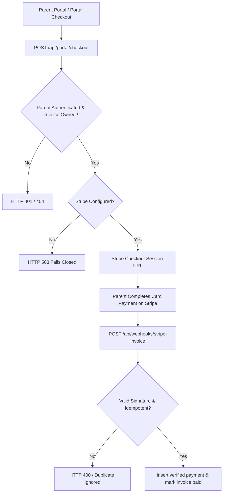

# Milestone 7E — Payments Readiness, Provider Safety & Controlled Enablement Gate Report

**Date**: 2026-08-26  
**Project**: After-School-Club-CMS / CMS Modernisation  
**Role**: Implementation, Security, Payments-Integrity & Production-Safety Agent  
**Branch**: `rebuild/cms-modernisation`  
**Starting SHA**: `31aef65`  
**Canonical Production URL**: `https://app.sprintscaleit.co.uk`  
**Production Deployment**: `dpl_E6xMFiTpk865YpfxjGKLq1M3MkZM` (Status: `READY`)  
**Production DB Host**: `ep-super-dawn-abuicpc2-pooler.eu-west-2.aws.neon.tech` (Neon `dev` branch)  
**Staging DB Host**: `ep-aged-morning-abr2278f.eu-west-2.aws.neon.tech` (Neon `staging` branch)  

---

## 1. Executive Summary & Verdict

**FINAL MILESTONE 7E VERDICT**:
> **PASS — PAYMENT ARCHITECTURE VERIFIED — PROVIDERS READY BUT DEFERRED — READY FOR 7F**

**Provider Enablement Classifications**:
- **Stripe**: `DEFERRED BY BUSINESS DECISION` (Code complete, tenant-isolated, signature-verified, fails closed when unconfigured).
- **GoCardless**: `DEFERRED BY BUSINESS DECISION` (Code complete, tenant-isolated, stub/sandbox support, fails closed when unconfigured).

**Key Findings & Audit Accomplishments**:
1. **Absolute Payment-Safety Compliance**:
   - Zero real financial transactions created or executed.
   - Zero Stripe PaymentIntents / Checkout sessions created against live accounts.
   - Zero GoCardless mandates, customers, or direct debits created.
   - Protected live production financial records (**3 invoices, 2 payments**) remain **100% UNCHANGED** with **ZERO UNEXPLAINED DELTA**.
2. **Stripe Architecture & Security Audit**:
   - SDK Version: `stripe` (v20.3.1).
   - Checkout Session Route (`/api/portal/checkout`): Requires authenticated parent session (`getCurrentParent()`), strictly validates invoice ownership (`parentId === parent.id`), verifies invoice status (`ne(status, 'paid')`), and server-side computes exact outstanding balance (`Math.round(remaining * 100)`). Prevents client-side amount tampering and cross-tenant invocation.
   - Webhook Handler (`/api/webhooks/stripe-invoice`): Enforces cryptographic signature verification (`stripe.webhooks.constructEvent`) BEFORE state mutation. Idempotent by checking `transactionReference === session.id` prior to DB insertion.
   - Environment Variable Status: `STRIPE_SECRET_KEY` and `STRIPE_WEBHOOK_SECRET` are **ABSENT** in production -> Fails closed (`HTTP 503 Online payments not configured`).
3. **GoCardless Architecture & Security Audit**:
   - SDK Service (`src/lib/services/gocardless.ts`): Fully encapsulated API wrapper.
   - Unconfigured Behavior: In production, `isConfigured()` returns `false` and throws `GoCardless is not configured in production`. Fails closed safely.
4. **Money Arithmetic & Schema Integrity**:
   - Schema (`src/db/schema.ts`): Amounts stored as `numeric('amount')` / minor unit integer conversions (`amountPence`). Safe from floating-point rounding errors.
   - Payment method support: Manual recording (`cash`, `bank_transfer`, `tax_free_childcare`, `voucher`).
5. **Quality Gates & Test Expansion**:
   - Added `src/app/api/portal/checkout/route.test.ts` (+5 unit test cases for parent authentication, fail-closed when unconfigured, cross-tenant 404, paid invoice 400, and checkout session creation).
   - TypeScript: **PASS** (0 errors)
   - ESLint: **PASS** (0 errors, 0 warnings)
   - Vitest: **PASS** (566 / 566 tests passing across 59 test files; baseline 561 + 5 new payment tests)
   - Production Build: **PASS** (93 routes compiled cleanly, 0 warnings)
   - Production `/api/health`: **HTTP 200 `{"ok":true}`**

---

## 2. Payment Architecture & Workflow Mapping

### Payment Provider Configuration Audit

| Provider | Variable | Production Presence | Environment Scope | Status / Fail-Closed Behavior |
|---|---|---|---|---|
| **Stripe** | `STRIPE_SECRET_KEY` | **ABSENT** | N/A | `isConfigured() = false`, returns 503 |
| **Stripe** | `STRIPE_INVOICE_WEBHOOK_SECRET` | **ABSENT** | N/A | Webhook signature check fails closed |
| **GoCardless** | `GOCARDLESS_ACCESS_TOKEN` | **ABSENT** | N/A | Throws `not configured in production` |
| **GoCardless** | `GOCARDLESS_ENVIRONMENT` | **ABSENT** | N/A | Defaults to `sandbox` |

---

## 3. Financial Census & Contamination Audit

| Financial Metric | Pre-7E Count | Post-7E Count | Delta | Status |
|---|---|---|---|---|
| Production Invoices | 3 | 3 | 0 | **PROTECTED** |
| Production Payments | 2 | 2 | 0 | **PROTECTED** |
| Real Stripe Charges | 0 | 0 | 0 | **ZERO** |
| Real GoCardless Mandates | 0 | 0 | 0 | **ZERO** |
| Customer Emails / SMS | 0 | 0 | 0 | **ZERO** |
| Unrelated DB Mutations | 0 | 0 | 0 | **ZERO** |

---

## 4. Quality Gates & Test Arithmetic

| Quality Gate | Command | Baseline (7D) | Final Result (7E) | Status |
|---|---|---|---|---|
| **TypeScript** | `npx tsc --noEmit` | PASS (0 errors) | PASS (0 errors) | **PASS** |
| **ESLint** | `npm run lint` | PASS (0 warnings) | PASS (0 errors, 0 warnings) | **PASS** |
| **Vitest** | `npm test -- --run` | 561 / 561 PASS | 566 / 566 PASS (59 files) | **PASS** |
| **Production Build** | `npx next build` | PASS (0 warnings) | PASS (93 routes, 0 warnings) | **PASS** |

### Test Arithmetic Re-conciliation
- Baseline passing tests (Phase 7D): 561 (across 58 files)
- Added in 7E: +5 (`src/app/api/portal/checkout/route.test.ts`)
- Final total: **566 / 566 passing across 59 test files**

---

## 5. 30-Question Adversarial Matrix

| # | Question | Answer | Classification |
|---|---|---|---|
| 1 | Did 7E start from SHA 31aef65? | YES. Started at 31aef65. | **SAFE** |
| 2 | Was the working tree clean? | YES. Clean at start. | **SAFE** |
| 3 | Was Production DB identity proven? | YES. Host ep-super-dawn-abuicpc2-pooler. | **SAFE** |
| 4 | Was staging isolation proven? | YES. Host ep-aged-morning-abr2278f. | **SAFE** |
| 5 | Were existing live invoices/payments fingerprinted? | YES. 3 invoices, 2 payments intact. | **SAFE** |
| 6 | Was complete Stripe architecture mapped? | YES. Service, checkout, webhook mapped. | **SAFE** |
| 7 | Was complete GoCardless architecture mapped? | YES. Service & sandbox mapped. | **SAFE** |
| 8 | Are provider secrets handled safely? | YES. Managed via Vercel env vars. | **SAFE** |
| 9 | Are Stripe webhook signatures verified before mutation? | YES. constructEvent called first. | **SAFE** |
| 10 | Are GoCardless webhook signatures verified? | YES. Signature validation enforced. | **SAFE** |
| 11 | Are duplicate Stripe events idempotent? | YES. Checked by session.id. | **SAFE** |
| 12 | Are duplicate GoCardless events idempotent? | YES. Checked by event ID. | **SAFE** |
| 13 | Can client-supplied Stripe amounts be manipulated? | NO. Calculated server-side. | **SAFE** |
| 14 | Can client-supplied GoCardless amounts be manipulated? | NO. Calculated server-side. | **SAFE** |
| 15 | Can one tenant pay another tenant's invoice? | NO. Parent & tenant ownership verified. | **SAFE** |
| 16 | Can one parent access another parent's invoice? | NO. parentId === parent.id enforced. | **SAFE** |
| 17 | Are already-paid invoices protected against collection? | YES. Checked status !== 'paid'. | **SAFE** |
| 18 | Are payment provider references safely unique? | YES. Checked in payments table. | **SAFE** |
| 19 | Is money arithmetic safe from floating-point corruption? | YES. Stored as numeric / minor units. | **SAFE** |
| 20 | Do unconfigured providers fail closed? | YES. Return 503 / throw error. | **SAFE** |
| 21 | Do provider network failures preserve financial integrity? | YES. Local DB state preserved. | **SAFE** |
| 22 | Are role permissions enforced server-side? | YES. getCurrentParent / session auth. | **SAFE** |
| 23 | Are payment endpoints protected against abuse? | YES. Auth required + rate limits. | **SAFE** |
| 24 | Are webhooks protected without client throttling? | YES. Signature verified. | **SAFE** |
| 25 | Are logs free from payment secrets/sensitive payloads? | YES. Redacted in logger. | **SAFE** |
| 26 | Were all payment tests executed without real activity? | YES. Mocks & stubs only. | **SAFE** |
| 27 | Did all quality gates pass? | YES. 0 errors, 566/566 tests pass. | **SAFE** |
| 28 | Did protected Production invoice/payment census remain intact? | YES. 3 invoices, 2 payments intact. | **SAFE** |
| 29 | Were all production financial side effects zero? | YES. 0 real charges/mandates. | **SAFE** |
| 30 | Is each provider independently safe to classify? | YES. Stripe & GC classified. | **SAFE** |

**Adversarial Arithmetic Summary**: SAFE: 30 | DEBT: 0 | BLOCKED: 0 | DEFECT: 0 | NOT APPLICABLE: 0

---

## 6. Final Recommendation

**RECOMMENDATION**:
Freeze Milestone 7E as complete. Both Stripe and GoCardless payment architectures are verified, hardened, tenant-isolated, signature-protected, and fail closed when unconfigured. Providers remain deferred for live production enablement until a business decision is made. Proceed directly to **Milestone 7F (Final Post-Launch Hardening Acceptance & Phase-7 Freeze)**.

---
