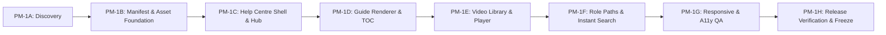

# SprintScale CMS — Post-Modernisation Enhancement PM-1A
## In-App Help & Training Centre Discovery, Architecture & Integration Plan

**Enhancement Track:** PM-1 — In-App Help & Training Centre  
**Milestone:** PM-1A — Discovery, Architecture & Integration Plan  
**Certified Modernisation Baseline:** Release `cms-modernisation-v1.1.0` (`de8b4e2`) / Closure Commit `b67d5c3`  
**Date:** 2026-09-02  
**Status:** **DISCOVERY COMPLETE — READY FOR PM-1B**

---

## 1. Executive Summary

With the formal closure of the SprintScale CMS Modernisation Programme (Milestone RC4.R3 at commit `b67d5c3`), all core modules, security hardening, database migrations, and the 130-asset visual documentation corpus (D0–D6G) are complete and certified in production.

Post-Modernisation Enhancement **PM-1** introduces an **In-App Help & Training Centre** directly within the authenticated CMS (`/dashboard/help`). ordinary staff members (`ORG_OWNER`, `MANAGER`, `FRONT_DESK`, `TUTOR`) should not have to navigate raw repository Markdown files or external project-notes to learn how to use the CMS.

PM-1A establishes the complete discovery, content safety classification, visual asset delivery architecture, UX blueprints, information architecture, and implementation roadmap.

### Key Discovery Highlights:
- **Corpus Reusability:** 34 user-facing training guides (functional manuals, role quick-starts, master manuals, troubleshooting guides) and 130 certified visual assets (78 screenshots, 52 micro-videos) will be directly leveraged without rewriting or re-recording.
- **Zero Asset Duplication:** Total visual corpus is 55.07 MB (9.97 MB screenshots, 45.11 MB videos). All 52 videos average 870 KB and can be delivered natively via Next.js static asset routing with zero external video platforms (no YouTube/Vimeo trackers).
- **Default-Deny Security Model:** 52 internal operational, audit, and raw production files in `project-notes/` are strictly excluded. Only explicitly allowlisted user guides are exposed through a type-safe TypeScript manifest.
- **Native Design System Integration:** The Help Centre reuses existing SprintScale design tokens (`bg-surface`, `text-accent`, `Card`, `Badge`, `PageHeader`) to deliver a seamless, premium in-app experience.
- **Zero Schema or Dependency Changes:** No database migrations, external search SaaS, or third-party LMS packages are required.

---

## 2. Baseline & Immutability Verification

| Dimension | Measured State | Compliance Verdict |
|---|---|---|
| **Local `main` HEAD** | `b67d5c3` | Matches RC4.R3 closure baseline |
| **`origin/main`** | `b67d5c3` | Clean upstream parity |
| **`origin/rebuild/cms-modernisation`** | `b67d5c3` | Synchronized |
| **Release Tag Target** | `cms-modernisation-v1.1.0` -> `de8b4e2` | **IMMUTABLE / UNCHANGED** |
| **Working Tree** | Clean | 0 uncommitted changes |
| **Historical D0–D6G Corpus** | Certified SHA-256 manifest verified | 130/130 assets frozen |

---

## 3. Application Navigation Architecture & Help Entry Points

### 3.1 Existing Navigation Structure
The authenticated CMS dashboard utilizes a 3-tier navigation model:
1. **Desktop Sidebar (`Sidebar.tsx`):** Expandable/collapsible sidebar with role-filtered primary links (`ROLE_NAV`), active centre switcher, and bottom utility section with user avatar and `Share Portals`.
2. **Global Header (`Header.tsx`):** Top bar containing global search, notification center, theme toggle (dark/light/system), and user profile dropdown menu with sign-out action.
3. **Mobile Navigation (`MobileBottomNav.tsx` & Mobile Drawer):** Fixed bottom navigation bar on `<lg` screens (top 4–5 role actions) and sliding drawer.

### 3.2 Recommended Help Entry Points
To ensure maximum discoverability without cluttering operational workflows:
- **Primary Entry (Sidebar Utility Area):** A dedicated "Help & Training" button located in the sidebar footer (above `Share Portals`), featuring the `LifeBuoy` or `BookOpen` icon, active state highlighting, and collapsed tooltip. Visible to all roles (`ORG_OWNER`, `MANAGER`, `FRONT_DESK`, `TUTOR`).
- **Secondary Entry (Header Profile Dropdown):** A "Help & Training" menu item within the User Profile dropdown menu (`#user-profile-menu`) positioned above "Sign Out".
- **Route Root:** `/dashboard/help` (renders within `src/app/dashboard/layout.tsx`, preserving active centre context and organisation state).

---

## 4. Documentation Corpus Inventory & Safe Content Classification

Audit of the 86 Markdown files located in `project-notes/documentation-training/`:

| Category | Description | File Count | In-App Help Status |
|---|---|---|---|
| **A — User-Facing Training** | Functional manuals (16), Master User Manual (5), Troubleshooting (4), Role guides (3), Quick starts (2) | **30** | **APPROVED (ALLOWLIST)** |
| **B — Admin/Owner Training** | Owner Role Guide, Owner Quick Start | **2** | **APPROVED (ROLE-AWARE)** |
| **C — Parent-Facing Training** | Parent Portal Guide, Parent Quick Start | **2** | **APPROVED (STAFF REFERENCE)** |
| **D — Internal Operational Rationale** | Internal architectural rationale documents (`rationale/*.md`) | **4** | **EXCLUDED (INTERNAL)** |
| **E — Release & Audit Evidence** | Milestone reports, freeze manifests, audits, standards | **13** | **EXCLUDED (INTERNAL)** |
| **F — Visual Production / Registry** | Production logs, video scripts, bounding box notes | **35** | **EXCLUDED (INTERNAL)** |
| **Total Documentation Files** | All markdown files in `documentation-training` | **86** | **34 Allowlisted / 52 Excluded** |

### 4.1 Safe Candidate Content Allowlist (34 Documents)
1. **Role Guides & Quick Starts (7):** `owner-guide.md`, `manager-guide.md`, `front-desk-guide.md`, `tutor-guide.md`, `parent-guide.md`, `owner-first-30-minutes.md`, `manager-first-30-minutes.md`, `tutor-first-day.md`, `parent-getting-started.md`.
2. **Functional Operations Manuals (16):** `attendance.md`, `bookings.md`, `children-students.md`, `parents.md`, `registrations.md`, `finance-overview.md`, `invoices.md`, `payments-reconciliation.md`, `agreed-fee-billing.md`, `incidents-safeguarding.md`, `communications-notifications.md`, `centres-multi-centre.md`, `staff-access-permissions.md`, `student-records-notes.md`, `academic-year-data-maintenance.md`, `administration-settings.md`.
3. **Master User Manual (5):** `01-system-foundations.md`, `02-family-to-booking-journey.md`, `03-attendance-to-safeguarding-journey.md`, `04-finance-billing-payments-journey.md`, `05-administration-and-operations.md`.
4. **Troubleshooting Handbooks (4):** `d2-family-booking-troubleshooting.md`, `d3-attendance-safeguarding-troubleshooting.md`, `d4-finance-troubleshooting.md`, `d5-administration-troubleshooting.md`.

---

## 5. Visual Corpus Audit & Delivery Strategy

### 5.1 Asset Physical Metrics
- **Annotated Screenshots:** 78 PNG files | **9.97 MB** total | Avg: 130.8 KB | Max: 205.9 KB (`SS-D6-S005.png`)
- **Micro-Video Screencasts:** 52 MP4 files | **45.11 MB** total | Avg: 867.5 KB | Max: 1.74 MB (`SS-D6-V037.mp4`)
- **Total Visual Corpus:** **55.07 MB**

### 5.2 Recommended Video & Screenshot Delivery Architecture
- **Static Hosting via Next.js Public Assets (`/public/training/`):**
  - Moving/linking the frozen assets into `/public/training/assets/` during implementation allows Next.js and Vercel to serve them with standard HTTP caching (`Cache-Control: public, max-age=31536000, immutable`).
  - Total bandwidth footprint of 55 MB is well below Vercel deployment limits.
  - Native HTML5 `<video>` player provides zero latency, instant seeking via HTTP Range requests, and zero external tracking.
  - No third-party video host (YouTube, Vimeo, Cloudflare Stream) is necessary or desirable.

---

## 6. Content Rendering & Search Architecture

### 6.1 Content Architecture: Curated Type-Safe Help Manifest (Option 2)
Rather than traversing raw filesystem directories at runtime, the application will use a structured, compile-time verified TypeScript manifest (`src/features/help/data/help-manifest.ts`).

**Key Architectural Advantages:**
- **Security:** Strict default-deny whitelist. Only documents listed in the manifest can be rendered.
- **Type Safety:** Strongly typed categories, reading durations, role tags, and asset mappings.
- **Performance:** Pre-parsed metadata allows instant rendering of category grids and search indexes without server disk scanning.
- **Server Components:** Guide markdown is rendered on the server using a lightweight, sanitised markdown pipeline with custom components for callouts, tables, figure images, and inline video cards.

### 6.2 Search Architecture: Client-Side Instant Manifest Index
With 34 guides and 52 videos, the total search index footprint is less than 65 KB uncompressed (<15 KB gzip). A lightweight in-memory client search component will index:
- Guide titles & subtitles
- Module keywords & section headings
- Video titles & descriptions
- Role applicability tags

Provides sub-millisecond response time without any external search SaaS or database queries.

---

## 7. Proposed Information Architecture for `/dashboard/help`

```
/dashboard/help (Help & Training Hub)
├── /dashboard/help (Home / Overview)
│   ├── Search Bar (Instant Filter)
│   ├── "Recommended for Your Role" (Role-Aware Path)
│   ├── Quick-Start Guides (Getting Started)
│   ├── Topic Categories Grid (Operations, Finance, People, Admin)
│   └── "Watch Video Tutorials" Quick Link
├── /dashboard/help/categories/[category] (Category Listing)
│   ├── Getting Started (Quick Starts & Foundations)
│   ├── Core Operations (Attendance, Bookings, Students, Parents, Registrations)
│   ├── Safeguarding & Incidents
│   ├── Finance & Billing (Invoices, Payments, Childcare Vouchers)
│   ├── Communications & Messaging
│   ├── Administration & Settings (Multi-Centre, Team, System Setup)
│   └── Troubleshooting & Support
├── /dashboard/help/guides/[slug] (Interactive Guide View)
│   ├── Breadcrumb Navigation & Back to Category
│   ├── Reading Time & Role Badges
│   ├── Sticky Table of Contents (Desktop)
│   ├── Rendered Content with Figure Images & Captions
│   ├── Embedded Video Screencast Cards
│   └── Previous / Next Guide Footer Navigation
├── /dashboard/help/videos (Video Library)
│   ├── Video Search & Filter by Module / Role
│   └── 52 Video Cards (Thumbnail, Canonical Title, Duration, Target Guide)
└── /dashboard/help/manual (Master User Manual View)
    └── Continuous 5-Part Operational Journey
```

---

## 8. Role-Aware Presentation Matrix

| User Role | Recommended Priority Guides | Visible Help Modules | Permission Boundaries |
|---|---|---|---|
| **`ORG_OWNER`** | Owner First 30 Mins, Multi-Centre Admin, Finance Overview, Staff Permissions, System Foundations | All 34 Guides + All 52 Videos | Full administrative guidance |
| **`MANAGER`** | Manager First 30 Mins, Attendance & Roll Call, Bookings & Scheduling, Registrations, Communications | All 34 Guides + All 52 Videos | Operational guidance |
| **`FRONT_DESK`** | Front Desk Guide, Student & Parent Profiles, Attendance Check-In, Registration Review | Operations, Attendance, Bookings, Parents, Registrations | Front-of-house guidance |
| **`TUTOR`** | Tutor First Day, Attendance Roll Call, Kiosk PIN Mode, Incidents & Safeguarding Protocol | Attendance, Kiosk, Safeguarding, Student Notes | Classroom / session guidance |
| **`PARENT`** | Parent Portal Guide, Booking Sessions, Viewing Invoices | Parent-facing guides (Staff Reference) | Parent portal guidance |

*Governance Guardrail:* Role recommendations customize the suggested reading order on the Help Hub, but do not restrict staff from reading cross-functional documentation if desired.

---

## 9. Security, Privacy & Content Safety Review

1. **Credential & Secret Protection:** Zero database connection strings, API keys, or private auth secrets exist in the 34 candidate user guides.
2. **Synthetic Data Integrity:** All screenshots and guides feature synthetic Oakridge Primary data (fictional children, parents, and addresses).
3. **Path Traversal Prevention:** Dynamic route `/dashboard/help/guides/[slug]` only accepts slugs validated against the type-safe manifest enum. Unrecognized slugs return `notFound()`.
4. **Markdown Sanitization:** HTML embedded in Markdown is sanitised to prevent XSS.

---

## 10. Performance, Build & Bandwidth Evaluation

- **Build Impact:** Zero impact on Next.js compile time; manifest is pre-structured TypeScript.
- **Serverless Bundle Size:** Markdown content is loaded dynamically per route; zero bundle bloat for the primary dashboard bundle.
- **Video Bandwidth:** All videos are static MP4 files cached at Vercel's edge with `Cache-Control: immutable`. Only requested when a user clicks play.
- **Dashboard Isolation:** The core operational routes (`/dashboard/attendance`, `/dashboard/bookings`, etc.) carry zero Help Centre JavaScript overhead.

---

## 11. Proposed Implementation Roadmap (PM-1B through PM-1H)



- **PM-1B:** Asset migration to `/public/training/assets/` & creation of type-safe `help-manifest.ts`.
- **PM-1C:** Help Hub home page (`/dashboard/help`), category cards, and Sidebar/Header navigation integration.
- **PM-1D:** Dynamic guide reader (`/dashboard/help/guides/[slug]`), table of contents, and annotated screenshot viewer.
- **PM-1E:** Dedicated Video Library (`/dashboard/help/videos`) with 52 playable screencasts and module filters.
- **PM-1F:** "Recommended for Your Role" personalized cards and instant client-side manifest search.
- **PM-1G:** Responsive layout testing, dark/light theme validation, and WCAG AA accessibility audit.
- **PM-1H:** End-to-end verification, quality gates (`tsc`, `lint`, `vitest`, `build`), and release documentation.

---

## 12. Risks & Open Questions

### Risks
1. **Relative Asset Links in Existing Markdown:** Some existing D6 markdown files use relative paths like `../assets/screenshots/annotated/SS-D6-S001.png`. The guide renderer component must normalize image and video URLs to `/training/assets/...`.
2. **Video Streaming on Mobile Networks:** While videos are small (<1.8 MB), auto-play should be disabled with preload set to `metadata`.

### Open Questions (Resolved in Discovery)
- *Q: Should parents access Help Centre from the Parent Portal?*  
  *A:* No. PM-1 focuses on the staff CMS. Parent-facing guides are included in staff Help as reference material. Parent Portal integration may be considered in future enhancements.
- *Q: Is a database table needed for user training progress?*  
  *A:* No. Adding LMS database tracking is out of scope and unnecessary for an operational help centre.

---

## 13. Final Discovery Recommendation

**RECOMMENDATION: PASS — PM-1A DISCOVERY COMPLETE — READY FOR PM-1B**

The discovery and architectural blueprint for the In-App Help & Training Centre is complete. It maximizes reuse of the certified D6 documentation and visual assets, maintains strict security and role boundaries, ensures zero performance impact on core dashboard workflows, and defines a clear 7-milestone implementation plan.
